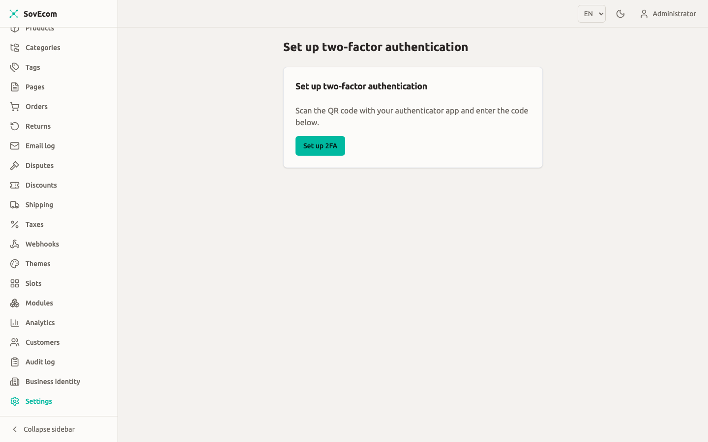

This guide gives you a backup routine for a self-hosted SovEcom stack, recovery objectives you can defend to a stakeholder, and a restore drill you run on a throwaway host. Run the drill once now, then on a schedule. The day your disk dies is a bad day to discover that your dumps were empty.

## What you must back up

SovEcom keeps almost all durable state in one Postgres database. Two things sit outside it and matter just as much.

| Asset | Where it lives | Lose it and… |
| --- | --- | --- |
| **Postgres database** | `pgdata` Docker volume (`/var/lib/postgresql/data` in the `postgres` service) | You lose orders, invoices, customers, catalog, settings. Everything. |
| **Master encryption key** | `MASTER_KEY` env var (base64) or the `/data/master.key` file the API reads | Your encrypted secrets become permanently unreadable. See below. |
| **Storefront media / uploads** | Object storage (S3-compatible) you configured at setup | Product images and file assets go missing from the storefront. |

:::caution[Back up the master key alongside the database, every time.]
SovEcom encrypts secrets at rest with **AES-256-GCM**. The `AeadService` (`apps/api/src/auth/crypto/aead.service.ts`) loads a 32-byte key from the base64 `MASTER_KEY` environment variable, or, if that is unset, from the raw bytes of `/data/master.key`. That key encrypts the 2FA/TOTP secrets, the `tenant_secrets` table, and webhook signing secrets. The ciphertext is bound to its owner through the GCM additional-authenticated-data. Restore the database to a host that has a **different** master key and those rows decrypt to garbage and fail closed. A database dump without the matching key is half a backup. Capture them together.
:::

:::note
In the shipped `docker-compose.yml`, the `api` service sets **no** `MASTER_KEY` and mounts **no** `/data` volume. You supply the key yourself, either by adding `MASTER_KEY` (base64 of 32 random bytes) to the `api` service environment, or by mounting a file at `/data/master.key`. Whichever you chose at install, that is the value your backup must protect. Treat it like a password: store it in your secrets manager, and keep an offline copy somewhere your database backups are not.
:::

## Recovery objectives (RPO / RTO)

Two numbers drive every decision below.

- **RPO (Recovery Point Objective)**: how much data you can afford to lose, measured in time. An RPO of one hour means a disaster may cost you up to the last hour of orders.
- **RTO (Recovery Time Objective)**: how long you can be down while you restore, measured in time.

These are targets for a single-server self-host. Pick the row that matches the stakes for your store, then build the schedule to hit it.

| Tier | RPO target | RTO target | How you get there |
| --- | --- | --- | --- |
| **Baseline** (small store, low volume) | ≤ 24 h | ≤ 2 h | Nightly `pg_dump`, off-host copy, master key in a secrets manager. |
| **Standard** (steady orders daily) | ≤ 1 h | ≤ 1 h | Nightly base `pg_dump` **plus** continuous WAL archiving, off-host. |
| **Strict** (high order volume) | ≤ 5 min | ≤ 30 min | WAL archiving with frequent base backups and a warm standby. |

:::caution
Your real RTO is whatever your **last rehearsed restore** took, not the target in this table. An untested plan has an RTO of "unknown". Run the drill below and write down the wall-clock time. That measured number is the one you report.
:::

Because SovEcom numbers invoices gaplessly and stores money as integer cents, treat a partial or out-of-order restore as worse than a clean older one. Restore to a single consistent point in time. Never hand-merge two dumps to "save" a few extra orders.

## Logical backups with pg_dump

`pg_dump` writes a single-database logical backup. You can move it across minor Postgres versions and inspect it as a file, at the cost of a slower restore on large datasets. It suits most self-hosted stores. SovEcom runs **Postgres 17** (`pgvector/pgvector:pg17`), so run a `pg_dump` client of the same major version.

### A nightly dump

Run this against the running `postgres` container. The `-Fc` custom format compresses the dump and lets you restore it with parallel `pg_restore` jobs later.

```bash
#!/usr/bin/env bash
set -euo pipefail

STAMP="$(date -u +%Y%m%dT%H%M%SZ)"
OUT="/var/backups/sovecom/db-${STAMP}.dump"
mkdir -p "$(dirname "$OUT")"

docker compose exec -T postgres \
  pg_dump -U sovecom -d sovecom -Fc --no-owner --no-privileges \
  > "$OUT"

# Fail loudly if the dump is suspiciously small (empty DB / broken auth).
if [ "$(stat -c%s "$OUT")" -lt 4096 ]; then
  echo "ERROR: dump $OUT is under 4 KiB — refusing to keep it" >&2
  rm -f "$OUT"
  exit 1
fi

echo "wrote $OUT ($(du -h "$OUT" | cut -f1))"
```

Back up the **master key** in the same run, to the same off-host destination. If you set `MASTER_KEY` in the environment, export it from your secrets manager. If you use the file form, copy `/data/master.key`. Encrypt the key copy at rest with a tool you control (`age`, `gpg`), and store its passphrase separately from the backup.

:::tip
SovEcom ships no backup script under `scripts/`. Save the snippet above as `/usr/local/bin/sovecom-backup` and own it yourself.
:::

### Get it off the host

A backup on the same disk as the database is not a backup. Copy each dump and the key off the host immediately: a separate machine, an S3 bucket with versioning and object-lock, or both. The `3-2-1` rule still holds: three copies, two media, one off-site.

### Schedule it

Use `cron` on the host. Stagger the upload so a long copy never overlaps the next dump.

```cron
# /etc/cron.d/sovecom-backup  — nightly at 02:15 UTC
15 2 * * *  root  /usr/local/bin/sovecom-backup >> /var/log/sovecom-backup.log 2>&1
```

Set retention deliberately. A common pattern: keep 7 daily, 4 weekly, 12 monthly. Prune older dumps so the disk never fills, and confirm your off-host store enforces the same retention.

## Point-in-time recovery with WAL

A nightly dump caps your RPO at roughly 24 hours. To do better you archive the Write-Ahead Log (WAL) continuously and replay it on top of a base backup, recovering to any moment between base backups. This is **continuous archiving / point-in-time recovery (PITR)**.

You need three pieces:

1. A **base backup** taken with `pg_basebackup` (a physical copy of the data directory).
2. **WAL segments** shipped off-host as Postgres fills them, via `archive_command`.
3. A `recovery` configuration at restore time that names your target time.

Set these in the `postgres` service config (a mounted `postgresql.conf`, or `command` flags):

```ini
# postgresql.conf — enable WAL archiving
wal_level = replica
archive_mode = on
archive_command = 'test ! -f /wal-archive/%f && cp %p /wal-archive/%f'
archive_timeout = 300   # force a segment at least every 5 min → ~5 min RPO floor
```

Mount `/wal-archive` to a volume you ship off-host (rsync to remote, or an S3 sync sidecar). Take a fresh base backup on a schedule (for example weekly) so replay never has to chew through months of WAL:

```bash
docker compose exec -T postgres \
  pg_basebackup -U sovecom -D - -Ft -z -Xfetch \
  > "/var/backups/sovecom/base-$(date -u +%Y%m%dT%H%M%SZ).tar.gz"
```

:::caution
WAL archiving costs you more operational attention than `pg_dump`. You watch that segments leave the host, that `/wal-archive` does not fill, and that base backups stay fresh. Adopt it when an RPO of hours is too coarse for your order volume. A tested nightly dump serves most baseline stores.
:::

## The restore drill: rehearse before you need it

Rehearse on a **throwaway host or a separate Compose project**, never on production. You prove three things end to end: the dump restores, the master key decrypts secrets, and the app boots against the restored database. Time the whole run and record it as your real RTO.

### 1. Stand up an empty target

Bring up Postgres alone, with a fresh empty volume, on the restore host.

```bash
docker compose up -d postgres
docker compose exec -T postgres \
  psql -U sovecom -d postgres -c "DROP DATABASE IF EXISTS sovecom;" \
  -c "CREATE DATABASE sovecom OWNER sovecom;"
```

### 2. Restore the dump

Feed the custom-format dump to `pg_restore`. Parallel jobs (`-j`) speed up large restores.

```bash
docker compose exec -T postgres \
  pg_restore -U sovecom -d sovecom --no-owner --clean --if-exists -j 4 \
  < /var/backups/sovecom/db-20260624T021500Z.dump
```

For a **PITR** drill instead, unpack the base backup into the data directory, drop the WAL segments into place, and create a `recovery.signal` with a `recovery_target_time` set to just before your simulated failure. Postgres replays WAL up to that instant on next start.

### 3. Restore the master key on the target

Place the **same** key the source host used. Either set `MASTER_KEY` in the target's `api` environment, or write the bytes to `/data/master.key`:

```bash
# File form — restore the exact bytes from your encrypted off-host copy
age -d -o master.key master.key.age
docker compose cp master.key api:/data/master.key
```

:::caution
A mismatched or missing key is the single most common reason a "successful" restore is useless. If you skip this step, login and product browsing may still work, but 2FA verification and anything reading `tenant_secrets` or webhook secrets will fail. Verify the key in step 5, not in production.
:::

### 4. Boot the app and run migrations

Bring up the rest of the stack against the restored database.

```bash
docker compose up -d api admin storefront
docker compose logs -f api   # watch for a clean boot, no env-validation errors
```

The API validates its environment at boot (`apps/api/src/common/env.validation.ts`). In production it rejects a known-default or all-zero `MASTER_KEY`. A boot failure here usually means the key did not make it onto the host, so fix the key before chasing other errors.

### 5. Verify, the step people skip

A restore that boots can still be a restore that lost data. Check the rows and the decryption.

- **Row counts match.** Compare key tables against what production reported before the drill:

  ```bash
  docker compose exec -T postgres psql -U sovecom -d sovecom -c \
    "SELECT 'orders' t, count(*) FROM orders
     UNION ALL SELECT 'customers', count(*) FROM customers
     UNION ALL SELECT 'products', count(*) FROM products;"
  ```

- **Money is intact.** Spot-check a known order total. Values are integer cents plus a currency code. `1999` with `EUR` is €19.99. A float anywhere is a corruption signal.
- **Invoice numbering is gapless.** Confirm the latest invoice number is the one production last issued, with no gaps or duplicates. Gapless numbering is a legal requirement, so a broken sequence after restore is a stop-the-line problem.
- **Encrypted secrets decrypt.** Log in as a test account with 2FA enrolled and complete a TOTP challenge on the restored host. Success proves the master key matches the data. If the TOTP code is rejected for a known-good authenticator, your key is wrong.



### 6. Record and tear down

Write down the wall-clock time from step 1 to a green step 5. That number is your **measured RTO**. Note the timestamp of the dump you restored: the gap to "now" is your **measured RPO** for this method. Then destroy the throwaway host and its volumes so no stale copy of production data lingers.

## A restore drill calendar

| Cadence | Action |
| --- | --- |
| **Nightly** | Automated `pg_dump` + key copy, both shipped off-host. Alert on a missing or undersized dump. |
| **Weekly** | Confirm the latest off-host dump exists and its size is in the expected range. Take a fresh `pg_basebackup` if you run PITR. |
| **Monthly** | Full restore drill on a throwaway host. Re-measure RTO/RPO. Fix anything that slowed you down. |
| **After a major upgrade** | Re-run the drill before you trust the new version with no rollback path. |

## Data retention and what you keep in backups

When you keep backups, you keep personal data, so your retention obligations as the data **controller** cover the copies sitting in cold storage too. When a record reaches the end of its retention window in production, let retention limits on the backup store age it out of the dumps over time. Leave the old dumps unedited. Align the backup retention table above with the data-retention schedule your store operates under, and write that alignment down.

:::note
Do not satisfy a customer erasure request by editing historical database dumps. Honor erasure in the live system, and let backups age out under their own retention. Editing a dump breaks its integrity and your ability to restore from it.
:::

## Related guides

- [Getting Started](/operator-guides/getting-started/): the stack layout, the `pgdata` volume, and the two mandatory Compose secrets.
- [Orders](/operator-guides/orders/): invoice numbering and order data you are protecting.
- [Customers](/operator-guides/customers/): the personal data your retention schedule governs.
