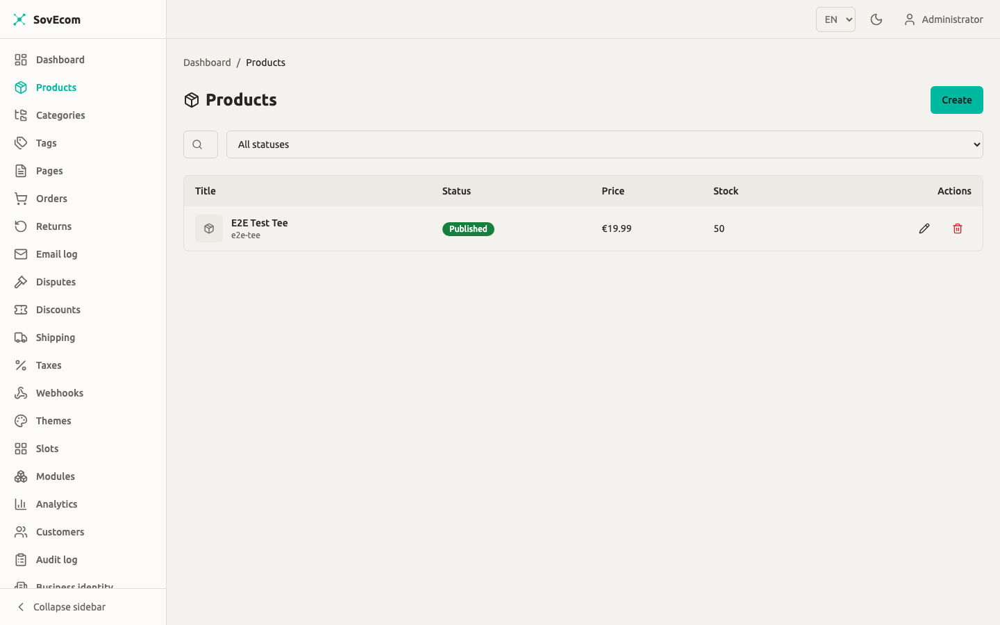
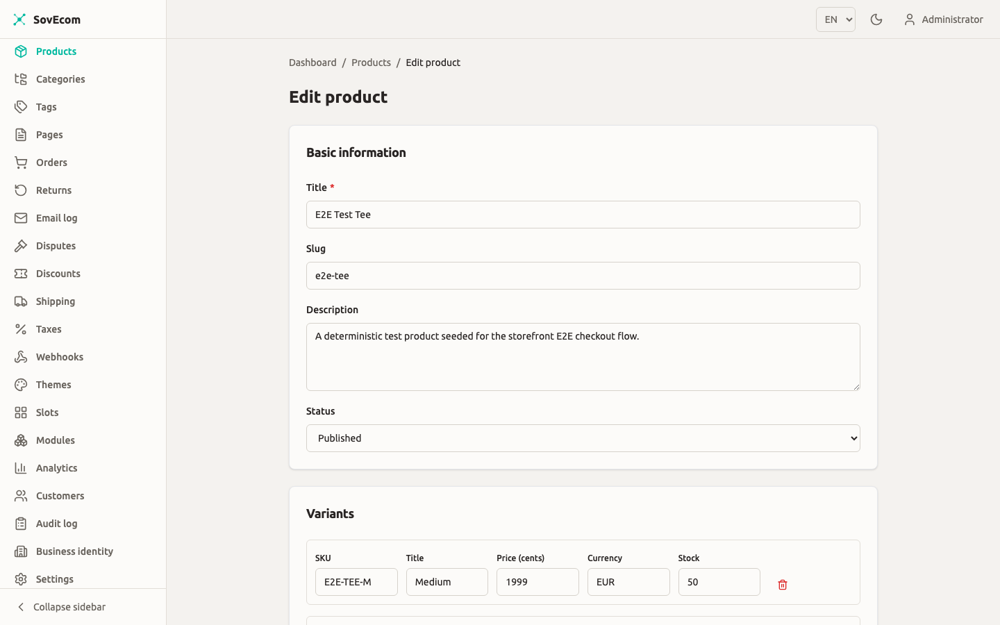

Build and maintain your catalog here: products and their variants, categories and tags, product images, and the EU compliance duties on your listings (GPSR safety identity and the Omnibus prior-price rule).

You drive the catalog through the admin API under `/admin/v1/`. Every write requires an authenticated user with the right permission (`products:write`, `categories:write`, or `categories:delete`). Each mutation records an audit row with your user id, IP, and user agent.



## Money model

Store prices as integer minor units plus a currency code. A product priced at €19.99 stores `priceAmount: 1999` and `currency: "EUR"`. Never send a decimal. Send the currency as an ISO-4217 three-letter code; the API upper-cases it on the way in, so `eur` and `EUR` both land as `EUR`.

| Field | Type | Meaning |
| --- | --- | --- |
| `priceAmount` | integer ≥ 0 | Selling price in minor units (cents) |
| `currency` | 3-letter code | ISO-4217, e.g. `EUR`, `USD` |
| `compareAtAmount` | integer ≥ 0, nullable | Strike-through reference price (see [Omnibus](#omnibus-prior-price-rule)) |

:::caution
Every variant of one product must share a single currency. The create endpoint rejects a product that mixes `EUR` and `USD` variants. Run one store currency, or split products per currency.
:::

## Products

A product is the listing. It carries a title, a URL slug, a description, an SEO title and description, a status, and a `metadata` JSON blob. Pricing and stock live on its variants, never on the product itself.

### Create a product

`POST /admin/v1/products` (permission `products:write`).

```json
{
  "title": "Merino Wool Beanie",
  "description": "Soft, warm, ethically sourced.",
  "status": "draft",
  "variants": [
    { "sku": "BEANIE-GREY", "title": "Grey", "priceAmount": 2900, "currency": "EUR", "stockQuantity": 40 }
  ]
}
```

What happens on create:

- **Slug.** Omit `slug` and SovEcom derives one from the title (`merino-wool-beanie`). A collision appends `-2`, `-3`, and so on. A title with no Latin characters falls back to a short unique suffix.
- **Default variant.** Send no `variants` array and SovEcom creates one default variant at `priceAmount: 0` in your store default currency (`STORE_DEFAULT_CURRENCY`, defaults to `EUR`). Edit it before you publish.
- **Status.** New products default to `draft`. Valid values are `draft`, `published`, `archived`.


### The publish guard

You cannot publish a product whose variant prices are still zero. `status: "published"` fails with a 422 if any variant has `priceAmount: 0` and carries no free flag. To ship a free item, set that variant's `options.free` to `true`:

```json
{ "title": "Free sample", "priceAmount": 0, "currency": "EUR", "options": { "free": true } }
```

Set every priced variant to at least 1 cent, or flag it free. The guard runs both when you create a product as `published` and when you PATCH an existing draft to `published`.

### Update a product

`PATCH /admin/v1/products/:id` (permission `products:write`). PATCH semantics: send only the fields you change. You can update `title`, `slug`, `description`, `status`, `seoTitle`, `seoDescription`, and `isBundle`. Changing the slug regenerates a unique one if your value collides.

### Delete a product

`DELETE /admin/v1/products/:id` (permission `products:write`). This is a hard delete. The cascade removes the product's variants and image links.

:::caution
Deletion is blocked once a product has sold. If any variant appears on an order line, the API returns 409 (`product has orders — cannot delete`). To hide a product that has order history, set its status to `archived` instead. Archived products drop out of the storefront but keep their fiscal record intact.
:::

### List and filter products

`GET /admin/v1/products` (permission `products:read`) returns an offset-paginated list. Query parameters:

| Param | Values | Default |
| --- | --- | --- |
| `page` | ≥ 1 | 1 |
| `pageSize` | 1–200 | 20 |
| `status` | `draft` / `published` / `archived` | all |
| `category` | category UUID | — |
| `tag` | tag UUID | — |
| `priceMin` / `priceMax` | integer cents | — |
| `inStock` | `true` / `false` | — |
| `sort` | `created` / `title` / `price` | `created` |
| `order` | `asc` / `desc` | `desc` |

## Variants

A variant is the buyable unit: one SKU, one price, one stock count. Every product has at least one. Use variants for size, colour, or any option that changes price or inventory.

`POST /admin/v1/products/:productId/variants` adds a variant. `PATCH .../variants/:variantId` updates one. `DELETE .../variants/:variantId` removes one. `POST .../variants/reorder` sets display order. All four need `products:write`.

| Field | Type | Notes |
| --- | --- | --- |
| `sku` | string | Unique per store. A collision gets a short suffix appended. |
| `title` | string, nullable | Variant label, e.g. "Large / Blue" |
| `options` | JSON object | Free-form attributes; `options.free = true` exempts a 0-price variant from the publish guard |
| `priceAmount` | integer cents | Required on create |
| `currency` | 3-letter code | Must match the product's other variants |
| `compareAtAmount` | integer cents, nullable | Strike-through price; read the Omnibus rule below before you set it |
| `stockQuantity` | integer ≥ 0 | On-hand count |
| `allowBackorder` | boolean | Sell past zero stock when `true` |
| `weightGrams`, `lengthMm`, `widthMm`, `heightMm` | integer, nullable | Used by shipping rate rules. See [Shipping](/operator-guides/shipping/). |

On a variant PATCH, send `currency` whenever you send `priceAmount`. Send the pair together or the request fails.

:::tip
Set `weightGrams` and the dimension fields on every variant you ship physically. Weight-based and dimension-based shipping rates read these. A missing weight falls back to whatever default your shipping zone defines.
:::

## Categories

Categories are a hierarchy. Each category has a name, a slug, an optional `parentId`, a display `position`, and its own SEO fields. Build a tree by pointing children at a parent.

`POST /admin/v1/categories` (permission `categories:write`) creates one. `PATCH /admin/v1/categories/:id` renames, re-slugs, re-parents, or repositions. `GET /admin/v1/categories` returns a flat list with each node's `parentId` so you can rebuild the tree client-side.

`DELETE /admin/v1/categories/:id` needs `categories:delete`. Deletion is blocked while the category has children: the API returns 409. Move or delete the child categories first, then delete the parent.

Assign categories to a product with `PUT /admin/v1/products/:id/categories` (permission `products:write`). This is replace-set: the body's `categoryIds` array becomes the product's complete category set. Send the full list every time, not a delta.

```json
{ "categoryIds": ["018f...a1", "018f...b2"] }
```

## Tags

Tags are flat labels with a name and a slug. No hierarchy, no SEO fields. `POST /admin/v1/tags` (permission `categories:write`) creates one; tag write and read reuse the category permissions. `DELETE /admin/v1/tags/:id` (permission `categories:delete`) removes a tag and unlinks it from every product.

Assign tags to a product with `PUT /admin/v1/products/:id/tags`, replace-set, same shape as categories with a `tagIds` array.

## Images

Upload first, then attach. Images are tenant-scoped assets you link to one or more products.

### Upload

`POST /admin/v1/images` (permission `products:write`), `multipart/form-data` with a `file` field and an optional `alt_text` query parameter. The file size limit is 10 MB.

On upload SovEcom:

- Strips all EXIF, GPS, XMP, and IPTC metadata from every output, including the re-encoded original. Customer-facing images never leak a camera's GPS coordinates.
- Bakes in EXIF orientation so rotated phone photos display upright.
- Generates four sizes, each in AVIF, WebP, and JPEG:

| Size | Width |
| --- | --- |
| `large` | 1920 px |
| `medium` | 800 px |
| `small` | 400 px |
| `thumbnail` | 150 px |

Each output fits inside its target width and never enlarges a smaller source. The response returns public URLs for every size and format, plus the original.

Open a product and choose **Edit** to manage its details, variants, and images — set alt text per image (required for accessibility and shown when an image fails to load).



### Attach, reorder, detach

- `POST /admin/v1/products/:id/images` with `{ "imageId": "...", "position": 0 }` links an uploaded image. Re-attaching the same image returns 409.
- `POST /admin/v1/products/:id/images/reorder` with an ordered array of image ids sets display order. Every id must already be attached to that product.
- `DELETE /admin/v1/products/:id/images/:imageId` unlinks an image from a product. Deleting the image asset itself is `DELETE /admin/v1/images/:id`, which removes all generated sizes from storage.

:::tip
Write real `alt_text` on upload. The storefront renders it as the image's accessibility label, and the European Accessibility Act (Directive 2019/882) makes WCAG-aligned alt text a legal requirement for EU consumer storefronts.
:::

## EU compliance fields

Two EU obligations land on products and pricing: GPSR safety identity and the Omnibus prior-price rule. Read both before you publish to EU customers.

### GPSR safety identity

The General Product Safety Regulation (EU 2023/988, in force since 13 December 2024) requires each consumer-product listing to show the manufacturer's identity and contact, the EU responsible person where the manufacturer sits outside the EU, and any safety or warning information.

:::caution[GPSR structured fields are not yet shipped]
Dedicated, queryable product-compliance fields for manufacturer, EU responsible person, and safety information are planned for a future release. As of this release the `products` table carries **no** such columns.

Until those fields ship, hold GPSR data in the product `metadata` JSON blob and the `description`, and render it in your theme's product page. Treat this as a manual control: `metadata` is free-form and not validated for completeness, so SovEcom cannot warn you when a listing is missing required GPSR identity. Populating GPSR data is your legal duty as the merchant; the platform surfaces what you enter.
:::

### Omnibus prior-price rule

The Omnibus Directive (EU 2019/2161) governs how you present a price reduction. Any "was X, now Y" claim must reference the **lowest price you applied in the 30 days** before the reduction. The original full price and any inflated anchor are both illegal here.

In SovEcom the `compareAtAmount` field on a variant holds the strike-through reference price. SovEcom stores and displays the figure exactly as you enter it. It keeps **no** 30-day price history and computes **no** prior-lowest figure for you.

:::caution[Your Omnibus obligation]
Set `compareAtAmount` only to a value that is genuinely the lowest price you charged for that variant in the preceding 30 days. Automatic 30-day-low tracking is not implemented in this release. You own the honesty of every strike-through price.

If you have not sold the variant below its current full price in the last 30 days, leave `compareAtAmount` null rather than invent a reduction.
:::

When you cut a price, update `priceAmount` to the new selling price and set `compareAtAmount` to the prior 30-day low. When the promotion ends, clear `compareAtAmount` (set it to `null`) so the storefront stops showing a strike-through.

For VAT, the OSS €10,000 threshold, and the 14-day withdrawal right, see [Tax](/operator-guides/tax/) and [Returns](/operator-guides/returns/).

## Bulk import

:::note[Bulk import is not yet available]
SovEcom ships **no** bulk product import in this release. There is no CSV upload, no batch product endpoint, and no admin import screen. Create products one at a time through `POST /admin/v1/products`, or script the API to loop over your source data.

To load a catalog now, write a script that calls `POST /admin/v1/images` for each asset, then `POST /admin/v1/products` (with its variants inline), then `PUT .../categories`, `PUT .../tags`, and `POST .../images` to wire up the relationships. Each call is audited individually.
:::

## Quick reference

| Action | Method + path | Permission |
| --- | --- | --- |
| Create product | `POST /admin/v1/products` | `products:write` |
| List products | `GET /admin/v1/products` | `products:read` |
| Update product | `PATCH /admin/v1/products/:id` | `products:write` |
| Delete product | `DELETE /admin/v1/products/:id` | `products:write` |
| Add variant | `POST /admin/v1/products/:id/variants` | `products:write` |
| Update variant | `PATCH .../variants/:variantId` | `products:write` |
| Upload image | `POST /admin/v1/images` | `products:write` |
| Attach image | `POST /admin/v1/products/:id/images` | `products:write` |
| Create category | `POST /admin/v1/categories` | `categories:write` |
| Delete category | `DELETE /admin/v1/categories/:id` | `categories:delete` |
| Assign categories | `PUT /admin/v1/products/:id/categories` | `products:write` |
| Create tag | `POST /admin/v1/tags` | `categories:write` |
| Assign tags | `PUT /admin/v1/products/:id/tags` | `products:write` |
