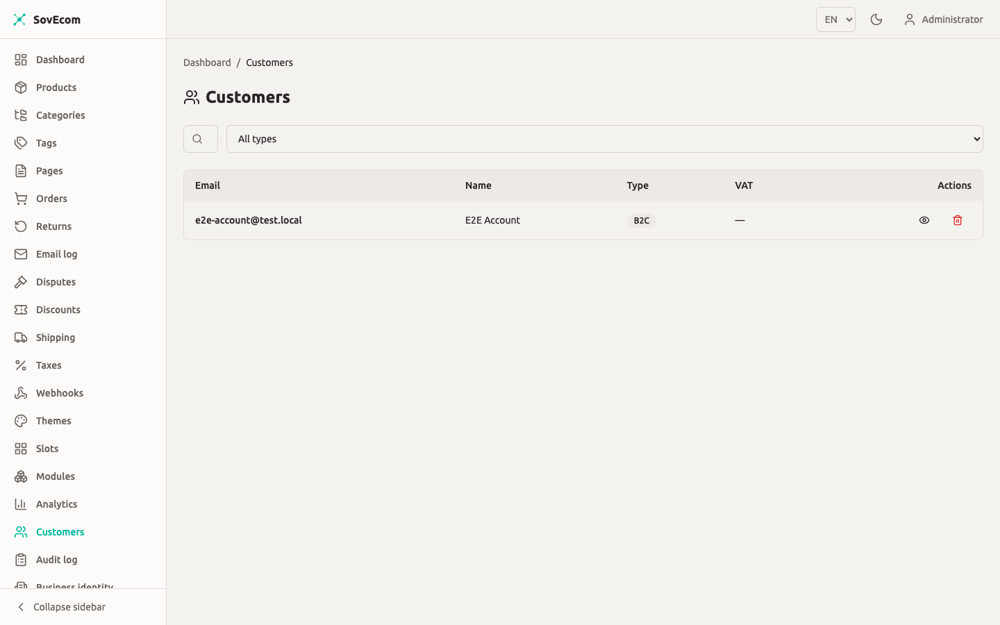
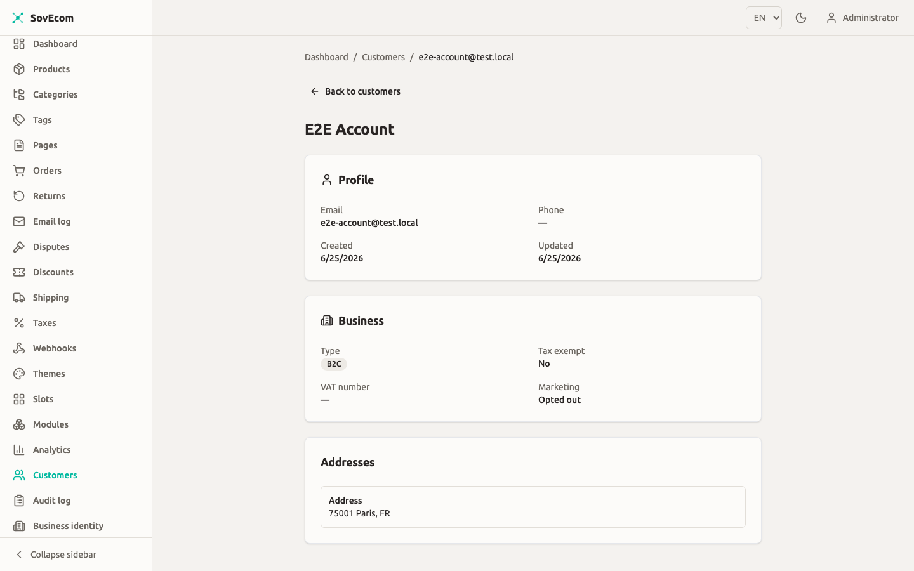
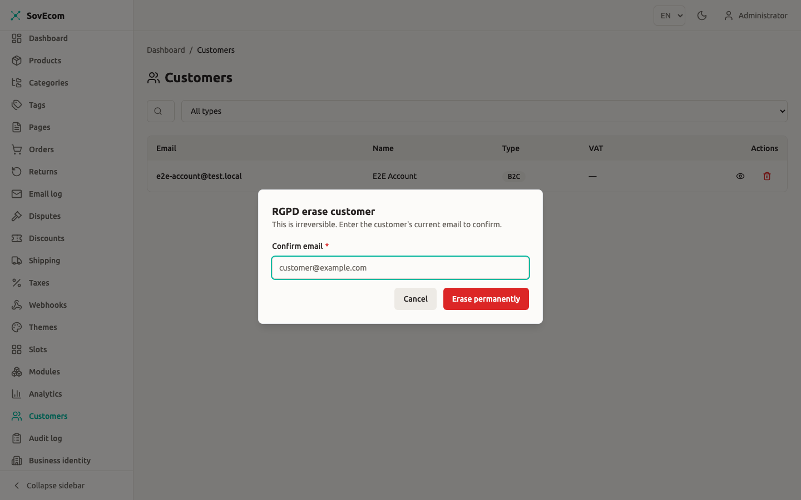

This guide covers how you manage customer accounts in a SovEcom store: creating and editing records, running B2B VAT validation against VIES, the per-account login lockout, and the RGPD export and erase paths. Every behavior below matches the API as it ships.

The customer API has two surfaces. Customers act on themselves under `/store/v1/customers` for signup, login, profile, addresses, and data rights. You act on customers under `/admin/v1/customers`, behind the admin JWT guard and a per-route permission. Every query on both surfaces scopes to your tenant.



## Permissions

Every admin customer route declares the exact permission it needs. Grant these through roles, not to individuals.

| Action | Route | Permission | Who holds it by default |
| --- | --- | --- | --- |
| List, get, list addresses | `GET /admin/v1/customers`, `GET /admin/v1/customers/:id`, `GET /admin/v1/customers/:id/addresses` | `customers:read` | staff, admin, owner |
| Create, update | `POST /admin/v1/customers`, `PATCH /admin/v1/customers/:id` | `customers:write` | admin, owner |
| RGPD erase | `DELETE /admin/v1/customers/:id` | `customers:delete` | admin, owner |

:::caution
A staff member with `customers:read` sees full PII (email, name, phone, VAT number, addresses). Treat read access as access to personal data and scope your roles accordingly.
:::

## Customer accounts

A customer record holds an email, an optional password hash, name and phone, the B2B flag and VAT fields, a tax-exempt flag, a marketing-consent flag, and a preferred locale for transactional email. No response, admin or store, returns the password hash, the TOTP secret, or the raw metadata blob. The serializer strips all three.

### Create a customer

`POST /admin/v1/customers` with `customers:write`. The admin form accepts more fields than self-signup, including `taxExempt` (a tax decision you own) and an optional password.

```json
POST /admin/v1/customers
{
  "email": "acme@example.com",
  "name": "ACME Procurement",
  "isB2b": true,
  "vatNumber": "FR12345678901",
  "taxExempt": false,
  "acceptsMarketing": false
}
```

Leave `password` out to create a passwordless record. Use this when you import a B2B contact who sets their own password later. A passwordless customer cannot log in until they set one through the forgot/reset flow.

Email uniqueness is case-insensitive and scoped to active rows per tenant. A second active account on the same address returns 409. A deleted or anonymized row never blocks a fresh signup.

### Edit a customer

`PATCH /admin/v1/customers/:id` with `customers:write`. You can change name, phone, the B2B flag, the VAT number, `taxExempt`, and marketing consent. Changing the VAT number re-runs VIES (see below). The DTO rejects internal columns (`vat_validated`, `totp_secret`, `metadata`, `anonymized_at`), so a client can never set them.

### Find customers

`GET /admin/v1/customers` uses offset pagination. Two filters exist today, `email` and `isB2b`:

| Query param | Effect | Default |
| --- | --- | --- |
| `email` | Case-insensitive substring match on email | none |
| `isB2b` | `true` or `false` facet | none |
| `page` | 1-based page number | `1` |
| `pageSize` | 1 to 200 | `20` |

The shipped list endpoint has no full-text search across name or phone, and no filter on VAT-validation status.



## B2B customers and VAT validation (VIES)

When a customer supplies a VAT number at signup, on admin create, or whenever the VAT number changes, SovEcom validates it against the EU VIES service. The check is **non-blocking** and never fails signup or an update. It sets the `vat_validated` flag and writes a durable proof object into the customer's metadata.

### How validation resolves

The VIES check returns one of three states. The flag flips to validated only on a live positive result.

| VIES result | `vat_validated` | What it means for tax |
| --- | --- | --- |
| `valid` | `true` | The number is a confirmed EU VAT registration. Reverse charge can apply. |
| `invalid` | `false` | The number cannot be a valid EU VAT number. Charge VAT. |
| `unreachable` | `false` | VIES was down or timed out. Tax stays safe; re-check later. |

SovEcom fails open on a VIES outage. A down or slow VIES collapses to `unreachable`, so it never blocks a customer from registering. Tax stays safe because `vat_validated` stays `false` until a real positive comes back.

:::caution
A VAT number stored on a customer does not by itself prove reverse-charge eligibility. Only `vat_validated = true`, a confirmed live VIES `valid`, records that. If you grant tax treatment off an unvalidated number, you carry the audit risk yourself.
:::

### When VIES runs and when it does not

VIES is an EU-VAT concept, so it runs only when the tenant tax mode is `eu_vat`. For a store on any other tax regime, such as a Pakistan or US store on `none`, SovEcom skips the SOAP call, stores the number as-is with `vat_validated = false`, and writes no proof. A non-EU tax ID never gets mislabeled "invalid". See the tax guide at [/operator-guides/tax/](/operator-guides/tax/) to configure the tax mode.

### The proof of record

A live `valid` response carries a per-consultation reference from VIES. SovEcom persists that `consultationRef` plus a timestamp into `customers.metadata.vat`. That stored proof is the evidence of record for an audit. The cache never is.

SovEcom caches positive results for 24 hours in Redis to save round-trips. A cached hit is marked `cached: true` with no `consultationRef`, so a cached result never borrows another customer's consultation reference. SovEcom never caches invalid or unreachable results and re-checks them every time.

Clearing a customer's VAT number drops the validation flag, the validation timestamp, and the stored proof in one update.

:::tip
To force a fresh live VIES consultation for an audit trail, clear the VAT number and re-save it through `PATCH`. SovEcom re-runs VIES only when the number changes, so re-entering the identical value does nothing. Clear it, save, then set it again to get a new live `consultationRef`.
:::

## Account security: per-account login lockout

Customer login has two independent defenses. The first is an IP-plus-email rate limit of 10 attempts per 60 seconds, which an attacker who rotates source IPs can defeat. The second, added by migration `0033`, is keyed on the customer row itself, independent of IP: the `failed_attempts` and `locked_until` columns.

### How the lockout works

Each wrong password increments `failed_attempts` on the customer row. At **5 failed attempts** the account takes a **15-minute soft lock** (`locked_until`). SovEcom stores the counter and lock per customer, so rotating IPs still trips them.

| Behavior | Value |
| --- | --- |
| Failed-attempt threshold | 5 |
| Soft-lock duration | 15 minutes |
| Lock scope | Per customer row (IP-independent) |
| IP-plus-email throttle (separate) | 10 attempts / 60 seconds |

A **correct password bypasses the lock** and clears it. An attacker cannot lock a victim out of their own valid credential, by design. The lock blocks only wrong-credential attempts. A locked-out customer who remembers their password still gets in, so no one gets DoS'd off their own account.

Login returns no "account locked" message. Every failure branch (throttled, unknown email, no password set, wrong password, locked) returns the same uniform 401 after equal cryptographic work. The endpoint never leaks which accounts exist or which are locked.

### What you see as an operator

The lockout is automatic. The shipped API has no admin "unlock this account" button. A soft lock expires on its own after 15 minutes, or clears the moment the customer enters the right password. The customer's own forgot/reset-password flow also restores access without the wait.

Every relevant event is written to the audit log:

| Audit action | When |
| --- | --- |
| `customer.login.success` | Correct credentials |
| `customer.login.failed` | Wrong password (or unknown email) |
| `customer.account.locked` | The attempt that trips the 5-attempt threshold |
| `customer.login.throttled` | The IP-plus-email rate limit fired |
| `customer.refresh.reuse_detected` | A rotated refresh token was replayed |

Audit rows store the attempted email only as a salted hash, never in plaintext.

:::note
Set `AUDIT_EMAIL_SALT` to at least 16 characters in production. The API refuses to start in production without it, since a missing salt makes the email-audit hash predictable.
:::

```bash
# Required in production for the customer-login audit hash
AUDIT_EMAIL_SALT=<random-string-min-16-chars>
```

### Customer 2FA

The `customers` table carries `totp_secret` and `totp_enabled` columns, plus a CHECK constraint that bars enabling 2FA without a secret. The customer-facing TOTP flow is **planned for a future release**. The columns exist, but the login path does not read them yet. Do not promise customer two-factor authentication to merchants today.

## Sessions and credential self-service

Customer auth uses a short-lived access token plus an httpOnly, `SameSite=Strict` refresh cookie scoped to `/store/v1/customers`. Refresh-token rotation runs a token family with reuse detection. Replaying a rotated token revokes the entire family.

Customers manage their own credentials without admin involvement:

- **Change password** (`POST /store/v1/customers/me/password`): requires the current password. Logs out every other session and keeps the current one alive.
- **Change email** (`POST /store/v1/customers/me/email/change`): verify-before-switch. Proves the current password, then emails a single-use link to the new address. The live email switches only after the customer clicks the confirmation link.
- **Forgot password** (`POST /store/v1/customers/forgot`): always returns 202 whether or not the email exists, so it never leaks account existence.
- **Reset password** (`POST /store/v1/customers/reset`): consumes a single-use token, returns 204 on success and 400 on a bad or expired token. A successful reset logs out every session.

You cannot read or set a customer's password from the admin API. The shipped API has no admin "send reset link" button. Direct the customer to the storefront forgot-password page.

## RGPD: export and erase

SovEcom erases by **pseudonymizing the row**. A scrubbed stub row stays behind so legal-retention obligations on past orders and invoices hold; the original row is never hard-deleted. Export and erase are separate operations, and erase never dumps PII as a side effect.

### Customer-initiated (self-service)

Both run from the storefront account area and require the customer to re-enter their current password (step-up). A wrong password returns 401 and nothing happens.

- **Export** (`POST /store/v1/customers/me/rgpd/export`): returns the customer's profile, addresses, orders with line items and address snapshots, invoice metadata, and email-log metadata as JSON. This satisfies Art. 15 and Art. 20. Money in the export is integer minor units plus a 3-letter currency code.
- **Erase** (`POST /store/v1/customers/me/rgpd/erase`): anonymizes the row, scrubs the VAT number, deletes addresses, revokes every session, and writes the audit row in one transaction. After erase the customer can no longer log in. Art. 17.

### Admin-initiated erase

`DELETE /admin/v1/customers/:id` with `customers:delete`. Echo the customer's **current email** exactly in `confirmEmail`. A mismatch or a missing value returns 400 and erases nothing. The audit row records who erased whom.

```json
DELETE /admin/v1/customers/{id}
{
  "confirmEmail": "acme@example.com"
}
```

:::caution
Erase is irreversible. A database CHECK enforces the in-place anonymization: the email is rewritten to `anonymized-…@deleted.local`, and name and phone go null. There is no undo. Confirm the email echo before you send the request.
:::



## Segments

SovEcom has no managed customer-segments feature: no segment entity, no CRUD, no per-customer segment assignment. Building, naming, and managing customer segments from the admin is **planned for a future release**.

What exists today is segment-based **discount targeting**. A discount targets one of a fixed set of segment values, evaluated per cart at checkout:

| Segment value | How it matches |
| --- | --- |
| `all` (or unset) | Every customer |
| `b2b` | The cart owner's account has `is_b2b = true` |
| `first_time` | The cart owner has no prior non-cancelled order |
| `returning` | The cart owner has at least one prior non-cancelled order |

SovEcom computes these at evaluation time from the account's B2B flag and order history. They are values you set on a discount, never labels you assign to a customer or see on the customer record.

## Quick reference

| Task | Endpoint | Permission |
| --- | --- | --- |
| List customers | `GET /admin/v1/customers` | `customers:read` |
| Get one customer | `GET /admin/v1/customers/:id` | `customers:read` |
| Create customer | `POST /admin/v1/customers` | `customers:write` |
| Update customer (re-runs VIES on VAT change) | `PATCH /admin/v1/customers/:id` | `customers:write` |
| List a customer's addresses | `GET /admin/v1/customers/:id/addresses` | `customers:read` |
| Erase a customer (RGPD) | `DELETE /admin/v1/customers/:id` | `customers:delete` |

For the security model behind tenant isolation and the audit log, see [/concepts/security/](/concepts/security/).
