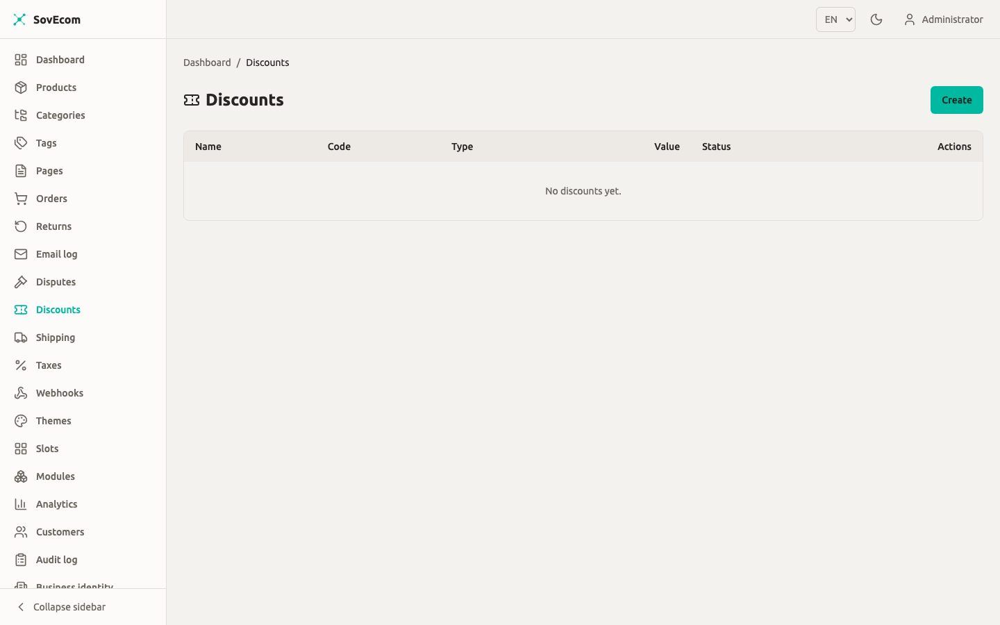
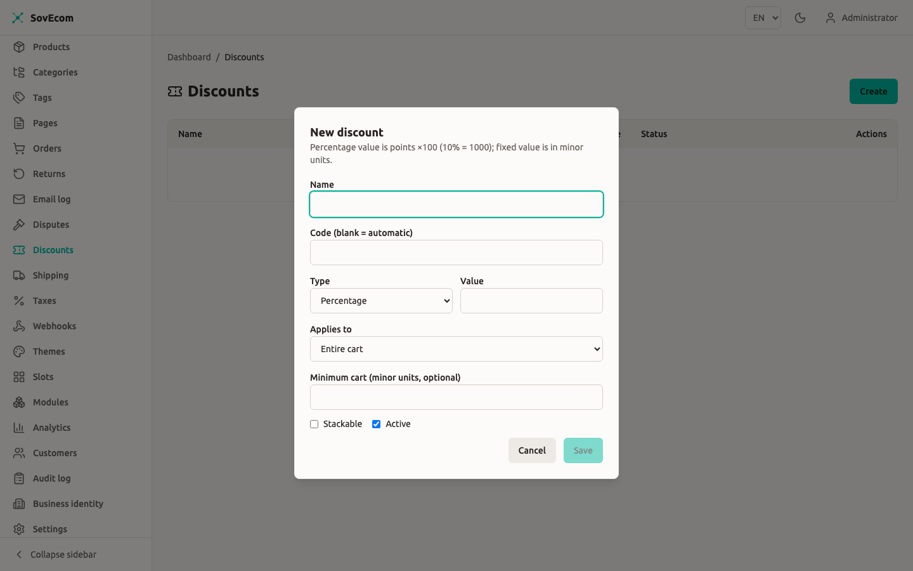

You manage every store promotion from one screen: percentage and fixed-amount discounts, code-based or automatic, scoped to the whole cart or to named products and categories. This guide covers how the engine evaluates a discount against a cart, what stacking does, how the system enforces usage limits, and the anti-abuse protections on the storefront apply endpoint.

All money in SovEcom is integer minor units (cents) plus a 3-letter ISO-4217 currency code. A `value` of `1000` on a fixed EUR discount means 10.00 EUR. A percentage of `1000` means 10.00%.

## Where discounts live

You administer discounts under **Catalog → Discounts** in the admin app. The list shows each discount's name, code (or `auto` for automatic), type, value, and active status. To create or edit, you need the `settings:write` permission. To read the list, you need `settings:read`. Both belong to the owner and admin roles. A staff account cannot open this screen, because a discount is store-wide promotional configuration.



SovEcom records every create, update, and delete in the audit log (`discount.created`, `discount.updated`, `discount.deleted`).

## Discount types

You pick one of two types when you create a discount.

| Type | `value` means | Example |
|------|---------------|---------|
| `percentage` | Percent ×100, capped at `10000` (100.00%) | `1500` = 15% off |
| `fixed` | A flat amount in minor units, plus a required currency | `value: 500`, `currency: EUR` = 5.00 EUR off |

A fixed discount must carry a currency, and it applies only when that currency matches the cart's currency. A 5.00 EUR fixed discount never touches a USD cart. When you choose **Fixed** as the type, the form prompts you for the currency field.

A percentage discount never exceeds 100%. Submit a percentage `value` above `10000` and the API rejects it; the form also caps the input client-side.

:::note
Percentage rounding is half-up to the minor unit, computed with integer math (`floor((base × value + 5000) / 10000)`). 50% of 10.01 EUR (1001 cents) rounds to 5.01 EUR (501 cents), not 5.00. A discount can never exceed the base it applies to.
:::

## Code vs automatic discounts

Leave the **Code** field blank and the discount is automatic. SovEcom evaluates every active automatic discount against every cart, with no code entry needed. Set a code and the discount applies only when the shopper enters that exact code on the cart.

A cart holds one explicit code at a time, and applying a second code replaces the first. Automatic discounts always evaluate alongside whatever code is set.

Codes are unique per store: you cannot create two discounts with the same code. The code field accepts 1 to 64 characters and is trimmed.

## Scope: what the discount applies to

Set **Applies to** to choose which part of the cart forms the base for the discount math.

| Scope | Base = | Targets needed |
|-------|--------|----------------|
| `all` (Entire cart) | The cart subtotal | None |
| `products` (Specific products) | Sum of line items whose product is in the target list | One or more product IDs |
| `categories` (Specific categories) | Sum of line items whose product belongs to a target category | One or more category IDs |

For `products` or `categories`, you paste the target IDs into the form, one per line. The field accepts up to 1000 IDs. A scoped discount with no targets is rejected.

A fixed discount is capped at its base. A 20.00 EUR fixed discount on a `products` scope whose matching line items total 12.00 EUR discounts 12.00 EUR, never more.



## Stacking rules

Check **Stackable** to let a discount combine with others on the same cart. The resolver follows three rules:

- Two non-stackable discounts cannot both apply. SovEcom keeps the single one that saves the customer the most.
- A non-stackable discount and a stackable discount both apply.
- Two stackable discounts both apply.

So among all eligible non-stackable discounts, only the largest-saving survives. Every eligible stackable discount applies on top. Each discount computes against the original base, so stacked discounts do not compound against each other.

The applied list is ordered largest-saving first. This matters for the final clamp: the engine never lets total discounts push the cart below zero, and taking the biggest saving first protects the customer when headroom runs out.

:::tip
For a "best single offer" promotion where you want only one coupon to win, leave every discount non-stackable. For an "everything adds up" event, mark each discount stackable.
:::

## Eligibility: when a discount applies

A discount loaded onto a cart still has to clear eligibility before it applies. On every cart recompute, the engine filters each candidate through these checks. A discount that fails any one contributes nothing.

| Check | Passes when |
|-------|-------------|
| Active | The discount's **Active** flag is on |
| Schedule | Now is within `startsAt`–`endsAt` (both inclusive, null = open-ended) |
| Minimum cart | The subtotal meets `minCartAmount` (at-threshold passes; null = no minimum) |
| Customer segment | The segment matches the cart owner (see below) |
| Usage limits | Neither the total nor the per-customer cap is reached |
| Currency (fixed only) | The discount's currency equals the cart's |
| Scope | At least one cart line matches the product/category target |

### Customer segments

A discount can target one segment. The engine matches it against the cart **owner**, so totals stay identical whether the cart moves through a cart cookie or a logged-in session.

| Segment | Matches |
|---------|---------|
| `all` | Every cart |
| `b2b` | Carts owned by a B2B customer account |
| `first_time` | A signed-in customer with no prior non-cancelled order |
| `returning` | A signed-in customer with at least one prior non-cancelled order |

A guest cart (no customer account) matches neither `first_time` nor `returning`. Those segmented discounts do not apply to guests. A cancelled order does not count as a prior purchase.

:::caution
The admin form does not yet expose the **customer segment** field. The API accepts `customerSegment` on create and update (`all`, `b2b`, `first_time`, `returning`), and the engine enforces it, but setting it from the UI is not yet available. To set a segment today, call the admin API. See the API reference below.
:::

## Usage limits

Two independent caps control how many times a discount can be redeemed.

| Limit | Field | Counts |
|-------|-------|--------|
| Total | `usageLimitTotal` | Redemptions across all customers |
| Per customer | `usageLimitPerCustomer` | Redemptions by one customer (by account, or by normalized email for guests) |

Both are positive integers; null means unlimited. SovEcom counts a redemption when an order completes at checkout. Typing a code into the cart counts for nothing until the order goes through. The order transaction locks the discount row, re-checks both caps against committed `discount_usages` rows, inserts the usage record, and increments `used_count`, all in one atomic step. This closes the race where two simultaneous checkouts both pass a "last redemption" eligibility read.

Guests are pinned by normalized (lowercased) email, so a once-per-customer code cannot be re-redeemed by checking out repeatedly as a guest with the same address.

:::caution
The admin form does not yet expose the **usage-limit** fields. The API accepts `usageLimitTotal` and `usageLimitPerCustomer`, and checkout enforces both, but editing them from the UI is not yet available. Set them via the admin API for now.
:::

## Scheduling

`startsAt` and `endsAt` are ISO-8601 timestamps with offset (for example `2026-07-01T00:00:00+02:00`). Both bounds are inclusive. Leave a bound null for an open-ended window: a discount with only `endsAt` runs from creation until it expires; one with only `startsAt` runs from that instant forward.

A discount outside its window stays in the list and remains active, but the engine treats it as ineligible until the window opens. You do not need to toggle **Active** for a time-boxed sale. Set the dates and let the schedule gate it.

:::caution
The admin form does not yet expose **startsAt / endsAt**. The API accepts both fields on create and update, and the engine enforces the window. Scheduling from the UI is not yet available. Set the dates via the admin API.
:::

## How a shopper applies a code

On the storefront, applying a code posts to `POST /store/v1/carts/:cartId/discounts` with `{ "code": "..." }`. SovEcom validates the code against the live cart, sets it as the cart's single code, and recomputes totals. Removing a code posts to `DELETE /store/v1/carts/:cartId/discounts/:code`.

### Opaque invalid-code response

A code that is unknown and a code that exists but does not help this cart return the **same** 422 with the same message: `Discount code is not valid for this cart`. The two cases are deliberately collapsed. Distinguishable errors would be a coupon-enumeration oracle, letting an attacker probe which codes exist. Your shoppers see one generic "not valid for this cart" message either way.

The eligibility judgment for a typed code runs that code on its own, never blended with automatic discounts. So an active automatic discount that already zeroes the cart cannot cause the engine to reject a valid code as ineligible.

### Apply-discount rate limit

SovEcom throttles the apply endpoint before any request reaches the cart or the discount engine, pairing the opaque 422 with a brute-force cap. Two limits run per 60-second window:

| Scope | Limit per 60s |
|-------|---------------|
| Per IP | 20 attempts |
| Per cart | 10 attempts |

Exceeding either returns HTTP 429 `Too many requests` with no enumerable detail. The limiter fails closed: when Redis is unreachable, SovEcom blocks the apply. A shopper who tries a handful of codes stays well under the cap; a script grinding through a code list hits it fast.

## Deleting vs deactivating

You can delete a discount that has never been redeemed. Once it carries redemption history, the API refuses the delete with a 409: `Discount has redemption history and cannot be deleted; deactivate it instead`. Redemption rows are a legal record of what each order was charged, so SovEcom keeps them. To retire a redeemed discount, clear its **Active** flag.

## Admin API reference

The form covers the common fields. Use these endpoints for segment, schedule, and usage-limit fields the UI does not yet expose. All routes require `settings:write` (mutations) or `settings:read` (reads) and live under `/admin/v1/discounts`.

```bash
# Create a B2B-only, scheduled, stackable 15% code, capped at 100 total redemptions
curl -X POST https://your-store.example/admin/v1/discounts \
  -H "Authorization: Bearer $ADMIN_TOKEN" \
  -H "Content-Type: application/json" \
  -d '{
    "name": "B2B summer 15%",
    "code": "B2BSUMMER",
    "type": "percentage",
    "value": 1500,
    "appliesTo": "all",
    "customerSegment": "b2b",
    "stackable": true,
    "usageLimitTotal": 100,
    "usageLimitPerCustomer": 1,
    "startsAt": "2026-07-01T00:00:00+02:00",
    "endsAt": "2026-07-31T23:59:59+02:00",
    "active": true
  }'
```

```bash
# Patch an existing discount: tighten its end date (PATCH semantics, send only changed fields)
curl -X PATCH https://your-store.example/admin/v1/discounts/$DISCOUNT_ID \
  -H "Authorization: Bearer $ADMIN_TOKEN" \
  -H "Content-Type: application/json" \
  -d '{ "endsAt": "2026-07-15T23:59:59+02:00" }'
```

Field summary:

| Field | Type | Notes |
|-------|------|-------|
| `name` | string | 1–255 chars, required |
| `code` | string or null | 1–64 chars; null/omitted = automatic |
| `type` | `percentage` \| `fixed` | required |
| `value` | integer ≥ 0 | percent ×100 (≤ 10000) or fixed minor units |
| `currency` | ISO-4217 or null | required for `fixed` |
| `minCartAmount` | integer ≥ 0 or null | minor units |
| `appliesTo` | `all` \| `products` \| `categories` | defaults to `all` |
| `targetIds` | UUID[] or null | required and non-empty for scoped discounts; max 1000 |
| `customerSegment` | `all` \| `b2b` \| `first_time` \| `returning` or null | not yet exposed in the UI; set via API |
| `stackable` | boolean | defaults to false |
| `usageLimitTotal` | positive integer or null | not yet exposed in the UI; set via API |
| `usageLimitPerCustomer` | positive integer or null | not yet exposed in the UI; set via API |
| `startsAt` / `endsAt` | ISO-8601 with offset or null | inclusive bounds; not yet exposed in the UI; set via API |
| `active` | boolean | defaults to true |

## Related guides

- [Tax configuration](/operator-guides/tax/) for how discounted totals interact with VAT.
- [Orders](/operator-guides/orders/) for where redemptions are recorded.
