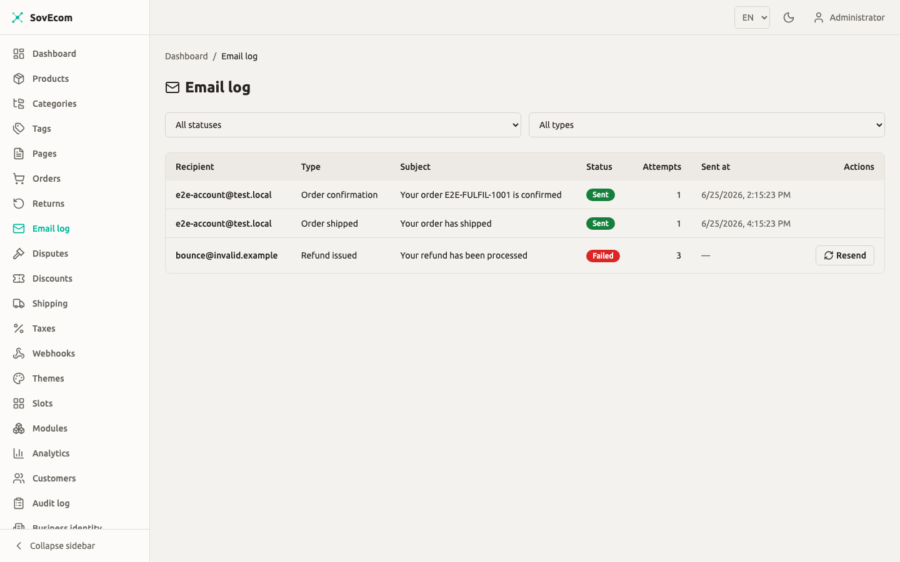

This guide covers outbound email for a self-hosted SovEcom store: which provider sends your mail, the transactional emails the API sends on its own, the DNS records that keep those emails out of spam, and what to do about bounces and complaints. Where a screen is not captured yet, you will see a screenshot placeholder.

For the orders that trigger these emails, see [Order Management](/operator-guides/orders/). For customer accounts and the addresses mail is sent to, see [Customers](/operator-guides/customers/).

## How SovEcom sends mail

The API picks one mail transport at boot, from environment variables, in a fixed order of preference:

1. **Brevo HTTP API** when `BREVO_API_KEY` is set. This is the default and recommended path.
2. **Custom SMTP** (nodemailer) when `SMTP_HOST` is set and no Brevo key is present.
3. **No-op** when neither is configured. The app still boots, and every send is skipped with a redacted log line. Use this only in development.

You configure exactly one. If you set `BREVO_API_KEY`, the API picks Brevo even when `SMTP_HOST` is also present, so do not set both unless you want Brevo to take priority.

:::caution
With no transport configured, the store runs but customers never receive order confirmations, shipment notices, refund emails, or password resets. The API does not warn the customer. It writes a startup log line: `mail disabled — no BREVO_API_KEY or SMTP_HOST configured; emails will not be sent`. Check your boot logs after deploy.
:::

### The sender address

Every email goes out from the value of `MAIL_FROM`. If you leave it unset, the API falls back to `no-reply@sovecom.local`, which no real mail server will accept and which fails SPF/DKIM. Always set `MAIL_FROM` to an address on a domain you control.

```bash
# An address on a domain you own and will configure DNS for.
MAIL_FROM="SovEcom Store <no-reply@store.example.com>"
```

The API parses the `Name <email>` form and passes the name and address through to the provider. A bare address (`no-reply@store.example.com`) also works.

## Option A: Brevo (default)

Brevo (formerly Sendinblue) is the recommended transport. The API calls Brevo's transactional HTTP endpoint (`POST https://api.brevo.com/v3/smtp/email`) with your API key in the `api-key` header.

### Steps

1. Create a Brevo account and verify it.
2. In Brevo, go to **SMTP & API → API Keys** and create a new key.
3. Add the sending domain (the domain in your `MAIL_FROM`) under **Senders, Domains & Dedicated IPs → Domains** and complete Brevo's domain authentication. Brevo gives you the DKIM and SPF records to publish (see [DNS authentication](#dns-authentication-spf-dkim-dmarc) below).
4. Set the environment variables on the API and restart:

```bash
BREVO_API_KEY="xkeysib-…"
MAIL_FROM="SovEcom Store <no-reply@store.example.com>"
```

5. Confirm the boot log shows `mail transport: brevo`.

:::caution[Disable open and click tracking in Brevo]
SovEcom sends no tracking pixels and requests no tracking from the API. To keep that promise, you must also turn off **open tracking** and **click tracking** at the Brevo account or template level. Brevo otherwise rewrites links and injects a tracking pixel by default, which leaks customer behavior. Find these under Brevo's **Settings → Email options / Tracking**.
:::

:::note
The API key is read from the environment and is never written to the application log. Treat it as a secret: keep it out of source control and out of the `.env` files you commit.
:::

## Option B: Custom SMTP

Use any SMTP relay (your own Postfix, Amazon SES SMTP, Mailgun SMTP, a managed provider) by setting the `SMTP_*` variables and leaving `BREVO_API_KEY` unset.

### Variables

| Variable | Required | Default | Notes |
|----------|----------|---------|-------|
| `SMTP_HOST` | Yes | — | Presence of this selects the SMTP transport. |
| `SMTP_PORT` | No | `587` | Port `465` switches the connection to implicit TLS (`secure`). Any other port uses STARTTLS. |
| `SMTP_USER` | No | — | Username for auth. Must be set together with `SMTP_PASS`. |
| `SMTP_PASS` | No | — | Password for auth. Both must be present to enable auth; otherwise the relay connects unauthenticated (for IP-allowlisted relays). |

```bash
SMTP_HOST="email-smtp.eu-west-1.amazonaws.com"
SMTP_PORT="587"
SMTP_USER="AKIA…"
SMTP_PASS="…"
MAIL_FROM="SovEcom Store <no-reply@store.example.com>"
```

Restart the API and confirm the boot log shows `mail transport: smtp`.

:::note
SovEcom turns off nodemailer's own logging so a message body, reset link, or order detail never lands in your application log. To debug an SMTP handshake, test against your relay with a tool like `swaks` rather than turning on debug output in the API.
:::

:::note
On a delivery failure the SMTP transport records a structured, address-free error (for example `SMTP error 550 (EENVELOPE) cmd RCPT TO`) instead of the raw server response. The raw `550` line from many servers embeds the rejected recipient address, which is personal data. The API strips it so that a copy of the recipient does not survive in the email log.
:::

## Transactional emails the API sends

The API sends these emails on its own, off domain events that fire after the relevant database transaction commits. You do not send them from the admin.

| Email | Trigger | Recipient | Contents |
|-------|---------|-----------|----------|
| Order confirmation | `order.created` (order placed) | The order's email address | Order number, line items, totals, ship-to address |
| Shipment notice | Order moves to `shipped` | The order's email address | Shipment notice for the order |
| Refund issued | A refund is recorded (`refund.issued`) | The order's email address | Refund amount and currency, credit-note number when present |
| Password reset (admin) | Admin password-reset request | The staff address | Reset link, expires in 1 hour. English only. |
| Password reset (customer) | Storefront password-reset request | The customer address | Localized reset link to the storefront |
| Email-change verification | Customer requests an email change | The new (pending) address | Single-use verification link |
| Email-change notice | Customer requests/confirms an email change | The current (old) address | Security notice, no link |

:::caution[Order confirmation fires at `order.created`, before payment]
The confirmation email sends when the order is created, which is before payment is captured. An unpaid order that never completes payment still receives a "confirmation". A future release may move this trigger to `order.paid`. Until then, do not treat a sent confirmation as proof of payment.
:::

### Templates and rendering

Templates are HTML-string functions built into the API. They use **inline styles only**, with no external CSS, images, web fonts, or tracking pixels, so the email renders the same offline and leaks nothing about the recipient. Money runs through the minor-units-aware formatter, so a JPY total (zero decimals) or a KWD total (three) renders correctly instead of a flat divide by 100.

Order and refund emails render in the customer's stored language. The composer reads `customers.locale` and resolves it to a supported locale; English (`en`) and French (`fr`) are supported, and anything unrecognized or missing (including guest orders) falls back to English. This resolution never blocks a send: if the locale cannot be read, the email goes out in English.

:::note[Custom templates are not editable in the admin]
Per-tenant template overrides and an in-admin template preview are **planned for a future release**, not shipped. There is no admin screen to edit subject lines or HTML today. To change template wording you edit the template source under `apps/api/src/emails/templates/` and redeploy.
:::

## The email log

The API records one row per send in an `email_logs` table for the order-related emails (order confirmation, shipment notice, refund issued). One send writes one row with its final outcome after the retry loop finishes, and the `attempts` count tells you how many tries it took. Each row holds the outcome, never the body: recipient, type, subject, status (`sent` or `failed`), attempt count, a sanitized error, the provider's message id, and timestamps. There is **no body column**; a resend re-renders from the source order.

### Viewing the log (API)

The admin endpoints are live; an admin UI screen for the email log is planned for a future release.

```http
GET /admin/v1/emails?status=failed&type=order_confirmation&orderId=<uuid>&page=1&pageSize=20
```

Query parameters:

| Parameter | Values | Notes |
|-----------|--------|-------|
| `status` | `sent`, `failed` | Filter by outcome. |
| `type` | `order_confirmation`, `order_shipped`, `refund_issued` | Filter by email type. |
| `orderId` | UUID | Show only emails for one order. |
| `page` | integer ≥ 1 | Default `1`. |
| `pageSize` | 1–200 | Default `20`. |

Listing requires the `orders:read` permission. The log is tenant-scoped; you only ever see your own store's rows.

The **Email log** screen (open *Email log* in the sidebar) lists every transactional email — recipient, type, subject, status, attempts, and when it was sent. Filter by status to find failed sends, and resend a failed message in place.



The same data is available over the API (`GET /admin/v1/emails`, `POST /admin/v1/emails/:id/resend`).

### Resending a failed email

```http
POST /admin/v1/emails/{id}/resend
```

This re-loads the source order, re-renders the template from `order_id` + `type` + `reference_id`, sends again, and writes a **fresh** log row (the original row is left intact as an audit trail). Resend requires the `orders:write` permission and is audit-logged as `email.resent`.

Two cases return an error instead of resending:

- The log row has no source order. Returns `422 Unprocessable Entity`.
- The source order data is no longer available. Returns `422 Unprocessable Entity`.

:::caution
A resent refund email re-derives the refund amount and currency from the refund row, but it does **not** restore the credit-note number, because there is no stored link from a refund to its credit note. A resent refund email therefore omits the credit-note reference that the original event-driven send included.
:::

### Retry behavior

Each send tries up to **3 times** with exponential backoff before it gives up and records a `failed` row. The backoff base is `EMAIL_RETRY_BASE_MS` (default `200`), giving waits of about 200ms then 400ms. The retry runs in-process, inside the send call; there is no durable queue. When all three attempts fail, the `failed` row is your signal to investigate and resend.

:::caution[A no-op send still logs as `sent`]
When no transport is configured, the send is skipped but the log still records `status='sent'` with an empty provider message id. If you see `sent` rows with no `provider_message_id`, check that you configured a transport.
:::

## DNS authentication (SPF, DKIM, DMARC)

SPF, DKIM, and DMARC are DNS records you publish for your sending domain. SovEcom does not manage these; you set them at your DNS host. Without them, Gmail, Outlook, and most mailbox providers send your order confirmations straight to spam or reject them.

Publish all three for the domain in your `MAIL_FROM`.

### SPF

An SPF record lists which servers may send mail for your domain. Publish a single `TXT` record at the domain apex naming your provider.

For Brevo:

```dns
store.example.com.  TXT  "v=spf1 include:spf.brevo.com -all"
```

For a custom SMTP relay, use that provider's include (for example `include:amazonses.com` for Amazon SES). Keep only **one** SPF record per domain; merge includes into it rather than adding a second `v=spf1` record. End with `-all` (hard fail) once you are confident every legitimate sender is listed.

### DKIM

DKIM adds a private-key signature to each message, so the receiver can verify it was not altered and came from your domain. Your provider generates the key pair and gives you the public key as a `TXT` (or `CNAME`) record to publish.

In Brevo, the records appear under **Senders, Domains & Dedicated IPs → Domains** after you add the domain. Brevo typically gives you two `CNAME` records (`brevo1._domainkey`, `brevo2._domainkey`) to publish:

```dns
brevo1._domainkey.store.example.com.  CNAME  b1.example-host.brevo.com.
brevo2._domainkey.store.example.com.  CNAME  b2.example-host.brevo.com.
```

Use the exact host values Brevo shows you; the example above is illustrative. For SES or another relay, follow that provider's DKIM instructions.

### DMARC

A DMARC record sets the policy receivers apply when SPF or DKIM fails, plus the address for aggregate reports. Start in monitor mode (`p=none`) so you can read reports without affecting delivery, then tighten to `quarantine` and finally `reject`.

```dns
_dmarc.store.example.com.  TXT  "v=DMARC1; p=none; rua=mailto:dmarc@store.example.com; fo=1"
```

Once your reports show SPF and DKIM passing on all legitimate mail, move `p=none` to `p=quarantine`, then `p=reject`.

### Verify

After publishing, confirm the records resolve:

```bash
dig +short TXT store.example.com          # SPF
dig +short TXT _dmarc.store.example.com   # DMARC
dig +short CNAME brevo1._domainkey.store.example.com  # DKIM (Brevo CNAME form)
```

Send a test order to a Gmail address, open the message, and use **Show original** to confirm `SPF: PASS`, `DKIM: PASS`, and `DMARC: PASS`.

:::tip
DNS changes can take up to a few hours to propagate. If a provider's dashboard says a record is "not found" right after you add it, wait and re-check before assuming a typo.
:::

## Bounce and complaint handling

A **bounce** is mail a server rejected (bad address, full mailbox, blocked sender). A **complaint** is a recipient marking your mail as spam. Both hurt your sender reputation, and a high rate gets your domain throttled or blocked.

### What SovEcom does today

For a synchronous rejection (the receiving server refuses the message during the send), the API records a `failed` row in the email log after its three attempts, with a sanitized, address-free error. You see these by filtering the log to `status=failed`.

:::caution[No inbound bounce or complaint webhook]
SovEcom does **not** ingest Brevo's bounce or complaint webhooks, and it does not maintain a suppression list. Asynchronous bounces (where the server accepts the message then bounces it later) and spam complaints do **not** show up in the SovEcom email log. An inbound bounce/complaint webhook is planned for a future release. Until then, monitor bounces and complaints in your provider's dashboard.
:::

### Recommended workflow

1. **Monitor in Brevo.** Watch the **Statistics → Transactional** and the bounce/complaint reports in your Brevo dashboard. Set up Brevo's own alerts for spikes.
2. **Suppress at the provider.** Brevo maintains its own suppression list and stops sending to hard-bounced and complained addresses. Let it; do not work around it.
3. **Fix bad addresses at the source.** A persistent bounce usually means a customer typo. Correct the customer's email under [Customers](/operator-guides/customers/) and, if needed, resend the affected email via `POST /admin/v1/emails/{id}/resend`.
4. **Keep complaint rate low.** Only send the transactional mail SovEcom sends by default. Do not repurpose the transactional sender for marketing; that is what drives complaints and gets the domain blocked.

## Privacy and data retention notes

- **No tracking.** SovEcom adds no open or click tracking. You must disable provider-level tracking too (see the Brevo caution above).
- **No body at rest.** The email log stores the outcome and subject line, never the message body. A resend re-renders from the source order.
- **Recipient is personal data.** The log keeps the recipient address (`email_logs.recipient`). RGPD erasure today scrubs orders and customers; the email-log recipient column is not yet scrubbed by that flow. If you run an erasure request, know that the erase flow does not yet scrub `email_logs.recipient`.

For the broader data-retention and erasure model, see [Customers](/operator-guides/customers/).
