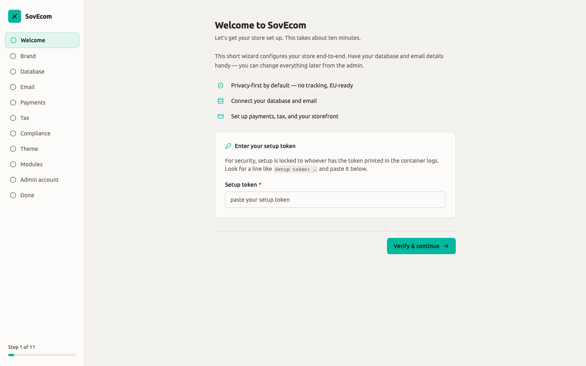
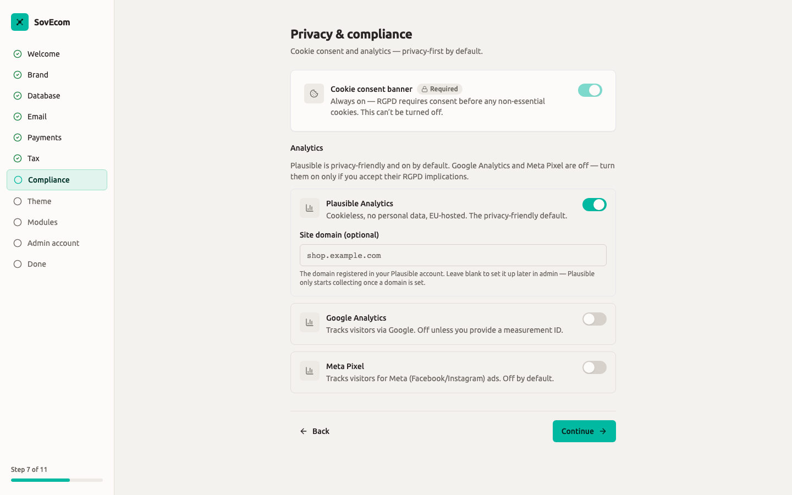
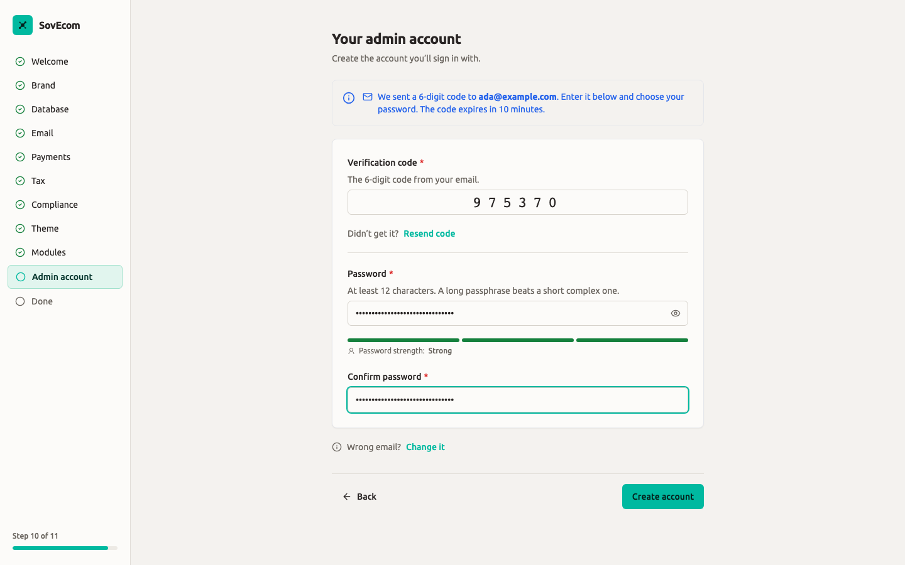
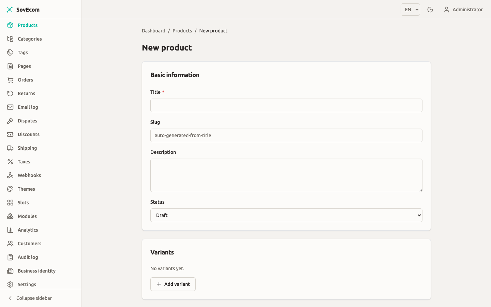

This guide takes you from an empty server to a live storefront with one product on it. You start the stack with Docker Compose, claim the one-time setup token from the container logs, walk the setup wizard, then create and publish a product. Plan for about fifteen minutes, plus whatever DNS and TLS take in your environment.

## What you need first

- A host with **Docker** and the **Docker Compose** plugin (`docker compose`, v2).
- The SovEcom repository checked out, or a copy of `docker-compose.yml` and the `docker/` directory.
- An **SMTP sender** you control (a Brevo API key, or host/port/credentials for any SMTP server). The wizard emails you a verification code before it lets you set the owner password, so email must work before you finish.
- A **VAT number** if you sell from an EU country. The wizard requires it and checks it against VIES.

:::note
SovEcom keeps money as **integer cents plus a currency code**, never floats. Every price you enter in the admin is in cents (for example, `1999` is €19.99). Keep that in mind throughout this guide.
:::

## 1. Configure the stack

The production stack lives in `docker-compose.yml`. It runs Postgres 17 (with pgvector), Redis 7, Meilisearch, the API, the admin SPA, the setup wizard, the Next.js storefront, and a Caddy reverse proxy on ports 80 and 443.

Two secrets are mandatory. Compose refuses to start without them:

| Variable | Used by | Notes |
|---|---|---|
| `POSTGRES_PASSWORD` | Postgres + the API's `DATABASE_URL` | Choose a strong value; it never leaves your host. |
| `MEILI_MASTER_KEY` | Meilisearch + the API search client | Any long random string. |

Set them in a `.env` file next to `docker-compose.yml`:

```bash
POSTGRES_PASSWORD=replace-with-a-long-random-secret
MEILI_MASTER_KEY=replace-with-another-long-random-secret
```

:::caution
The bundled `.env.example` ships **development** values (`devpassword`, `devkey`) and targets the dev compose file. Never reuse those in production. Generate fresh secrets, for example with `openssl rand -base64 32`.
:::

Set one optional variable to fix the setup banner link. The API reads `SETUP_URL` and prints it in the first-boot log banner. Leave it unset and the banner prints the placeholder `http://YOUR_HOST/setup`. Set it to the address your operators open:

```bash
SETUP_URL=http://setup.localhost
```

### Routing and hostnames

Caddy routes each app to its own host (see `docker/Caddyfile`):

| App | Host (default Caddyfile) |
|---|---|
| Storefront (public site) | `http://localhost` |
| Admin | `http://admin.localhost` |
| Setup wizard | `http://setup.localhost` |
| API (and `/health`) | `http://api.localhost` |

`*.localhost` resolves to `127.0.0.1` in browsers, so this works on the machine running Compose with no DNS changes. For a real deployment, map these subdomains to your domain and turn on Caddy's automatic HTTPS. See [Deployment](/guides/deployment/) for the production proxy setup.

## 2. Start the stack

From the directory holding `docker-compose.yml`:

```bash
docker compose up -d --build
```

Compose builds the API, admin, setup, and storefront images and starts every service. The first build pulls base images and compiles the apps, so give it a few minutes. Postgres, Redis, and the API come up in dependency order through their health checks.

Confirm the API is healthy:

```bash
curl http://api.localhost/health
```

## 3. Get the one-time setup token

SovEcom does **not** ship a default admin password. On first boot, while the system is not yet installed, the API mints a single setup token, prints it once to stdout, and expires it after 24 hours. This is the same pattern GitLab and Discourse use, and it closes the default-credentials attack that hits fresh self-hosted installs.

Read the token from the API container logs:

```bash
docker compose logs api
```

Look for the banner. It prints once, near the top of the API's boot output:

```
═══════════════════════════════════════════════════════════════
  SovEcom is not yet configured.
  Open the setup wizard at: http://setup.localhost
  Enter this one-time setup token:

     <your-one-time-token>

  This token will expire in 24 hours and can be used once.
  Regenerate it by restarting the container if needed.
═══════════════════════════════════════════════════════════════
```

:::tip
Lost the token, or let it expire? Restart the API container while the store is still uninstalled. Boot supersedes any earlier unused token and mints a fresh one, then reprints the banner.

```bash
docker compose restart api
docker compose logs api
```
:::

:::caution
The banner is the **only** place the plaintext token is ever emitted. Copy it from the logs, not from any API response. The token verifies once and is consumed when you complete setup.
:::

## 4. Run the setup wizard

Open the wizard at `http://setup.localhost` (or whatever you set as `SETUP_URL`). It runs eleven steps. The wizard refuses to run again once the store is installed, so this is a one-time pass.

The wizard's first step asks for the **setup token** printed in your container logs — this locks setup to whoever can read the logs, so nobody can hijack a fresh install.



### Welcome

Paste the setup token and select **Verify & continue**. The wizard validates the token against the API before it advances. An invalid or expired token shows an inline error and does not move forward. Get a fresh one from the logs if needed.

### Brand

Upload an optional logo (PNG, JPEG, WebP, or SVG, up to 5 MB) and pick your primary and secondary colours. Turn on the **gradient accent** toggle to blend the two. Everything here is optional; the defaults are a teal primary (`#00B9A0`) and a dark secondary. You can change all of it later in the admin.

### Database

Choose **Bundled Postgres** (recommended, nothing to configure) to use the Postgres that ships in the stack, or **External database** to point at a managed Postgres (Neon, Supabase, RDS). For external, paste a `postgres://` or `postgresql://` URL and use **Test connection** to probe it before continuing.

### Email

Pick **Brevo** (one API key, mapped to Brevo's SMTP relay) or a **custom SMTP** server (host, port, TLS, optional credentials). Set the "from" address your store sends from. Use **Send test email** to confirm delivery.

:::caution
Finish this step before you move on. The Admin account step emails you a 6-digit code, and the API cannot send it until you configure email delivery. Skip ahead and that step sends you back here.
:::

### Payments

Select the methods you want to accept: Stripe (cards), SEPA Direct Debit, Apple Pay / Google Pay (via Stripe), or Manual / offline. Checking **Stripe (cards)** reveals fields for the secret key, publishable key, and webhook secret; these are stored encrypted at rest. This step is optional. You can continue with nothing selected and wire payments up later from the admin. See [Payments](/operator-guides/payments/) for the full setup.

### Tax

Pick your **business country**. The wizard sets a tax default from it:

- Pick an **EU country** and the wizard turns on **EU VAT** and tax-inclusive pricing, then shows the VAT-number and OSS controls.
- Pick a **non-EU country** and it defaults to **no automatic tax**.

For an EU business you must enter your **EU VAT number** with the country prefix, for example `FR12345678901`. Select **Validate & continue** and the wizard checks it against VIES inside the same request. The check fails open. A "valid" verdict shows a green check. An "invalid" verdict warns you but still lets you continue and correct it later. A VIES outage is informational and never blocks setup.

Set the **OSS posture** to match the One-Stop-Shop rule for your cross-border EU B2C sales:

| Choice | Effect |
|---|---|
| Below the **€10,000** threshold | Charge your home-country VAT. |
| Above the threshold, or opted in | Charge destination VAT via OSS. |

:::caution[EU VAT guardrail]
Selecting **No tax** for an EU country is blocked. An EU VAT-registered merchant is legally required to charge VAT, so the wizard (and the server) reject it. Switch back to **EU VAT** to continue.
:::

Full ongoing tax operations live in [Tax & VAT](/operator-guides/tax/) and [EU Invoicing & VAT Ops](/operator-guides/invoicing-vat/).

### Privacy & compliance

This step is privacy-first by default (RGPD):

- The **cookie consent banner** is locked **on**. Consent is required before any non-essential cookie, and the server hard-pins this regardless of the UI. You cannot turn it off.
- **Plausible** analytics (cookieless, no personal data, EU-hosted) is on by default. Add your registered site domain to start collection, or leave it blank and set it later. Plausible only collects once a domain is set.
- **Google Analytics** and **Meta Pixel** are off. Enabling either reveals an **RGPD warning** and a required id field. Both ship visitor data to non-EU processors, so you are responsible for a lawful basis, a data-processing agreement, and disclosing the tracker in your privacy policy.

See [RGPD & Data Retention](/operator-guides/rgpd-data-retention/) for your obligations as controller.

The **Privacy & compliance** step is privacy-first by default: the cookie consent banner is always on (RGPD), Plausible (cookieless, EU-hosted) is enabled, and Google Analytics + Meta Pixel are **off** — each carries an RGPD warning and only turns on if you accept its implications.



### Storefront theme

Pick a starting theme from the seeded set (the `default` and `boutique` themes). The first is pre-selected. Continuing activates the theme you chose. Theme previews are placeholders for now; switch themes anytime from the admin once the gallery lands. See [Themes](/guides/themes/) for theme development.

### Modules (optional)

This step lists the platform's **built-in modules** so you can install and enable them during onboarding. The starter set is **reviews**, **recently-viewed**, **wishlist**, and **notify back in stock**. Each card shows what the module adds (the storefront slots it renders into) and the permissions it requests.

Select the ones you want and choose **Continue** to install and enable them. Each module runs **sandboxed** in a forked worker. Install runs no module code; enabling forks the worker and runs the module's migrations. The step is **optional**, so **Skip** installs nothing. Anything already installed shows an "Installed" badge and stays untouched. If a module fails to install, the wizard names it and keeps you on the step. Deselect that module and continue, or add it later.

:::note
The wizard installs only this curated, name-allowlisted set. The server validates every id against the allowlist, so the setup token can never install an arbitrary upload. To upload your own modules, sign in as an admin after launch and manage them from there. See [Modules](/guides/modules/).
:::

### Admin account

This creates the account you sign in with, in two phases:

1. **Request.** Enter your name and email, then select **Send verification code**. The API emails a 6-digit code to that address. The email becomes your sign-in identity.
2. **Verify.** Enter the code (it expires in 10 minutes; use **Resend code** if needed) and set your password. The password must be **at least 12 characters**, and the server rejects any password on its bundled weak-password denylist (an offline check, no third-party lookup). Use a long passphrase.

The **Admin account** step emails a 6-digit verification code, then has you set a password (minimum 12 characters — a long passphrase beats a short complex one). This is the account you'll sign in to the admin with.



### Done

Review the summary (brand colour, database mode, tax regime, currency, admin email), then select **Finish setup**. This consumes the setup token, flips the system to installed, and redirects you to the admin. If a precondition is still missing (no admin account, no tax settings, or an expired token), the wizard names it and offers a jump back to the step that fixes it.

After this point, reopening the wizard URL shows an **"Already set up"** screen with a single link to the admin. The wizard never runs twice.

## 5. Sign in to the admin

Open `http://admin.localhost` and sign in with the email and password you just created. The admin is where you manage catalog, orders, customers, discounts, shipping, and store settings.

## 6. Create your first product

In the admin, go to **Products** in the sidebar, then **New product** (route `/products/new`).



Fill in **Basic information**:

| Field | Notes |
|---|---|
| **Title** | Required. |
| **Slug** | Optional. Leave blank and it is generated from the title. This becomes the storefront URL. |
| **Description** | Optional free text. |
| **Status** | `Draft`, `Published`, or `Archived`. Only **Published** products appear on the storefront. |

Add at least one **variant**. Each variant has:

| Field | Notes |
|---|---|
| **SKU** | Your stock-keeping code. |
| **Price (cents)** | Integer cents. Enter `1999` for €19.99. |
| **Currency** | ISO code, e.g. `EUR`. |
| **Stock quantity** | Integer. |
| **Position** | Sort order among variants. |

:::caution
You cannot publish a variant priced at `0` unless you mark it free. Set a non-zero price in cents or enable the free option, or the save returns an error.
:::

Optionally attach product **images**, then assign **categories** and **tags**. Save the product. To make it public, set **Status** to **Published** and save again.

:::note[Accuracy: GPSR and Omnibus product fields]
The current admin product form covers title, slug, description, status, variants (SKU, price in cents, currency, stock, position), images, categories, and tags. It does **not** yet expose GPSR safety fields (manufacturer, responsible-person, warnings) or the Omnibus prior-price field on this screen. Both are planned for a future release. Where the platform enforces EU pricing and invoicing rules (VAT, OSS, gapless invoice numbering), see [EU Invoicing & VAT Ops](/operator-guides/invoicing-vat/).
:::

For the full catalog workflow (categories, tags, bulk operations, search indexing), see [Catalog](/operator-guides/catalog/).

## 7. View your storefront

Open the public storefront at `http://localhost`. Browse the product listing at `/{locale}/products` (for example `http://localhost/en/products`), and open your product at `/{locale}/product/{slug}` (for example `http://localhost/en/product/my-first-product`). A published product with a priced variant appears with its title, description, image, and VAT-aware price.

If the product does not show up:

- Confirm its **Status** is **Published**.
- Confirm at least one variant has a non-zero **Price (cents)** and a currency, or is marked free.
- Confirm you are on the right **locale** segment in the URL.

## Where to go next

- [Catalog](/operator-guides/catalog/): products, categories, tags, search.
- [Tax & VAT](/operator-guides/tax/) and [EU Invoicing & VAT Ops](/operator-guides/invoicing-vat/): ongoing tax and compliant invoicing.
- [Payments](/operator-guides/payments/): Stripe, SEPA, and method configuration.
- [Email & Deliverability](/operator-guides/email/): sender reputation and transactional mail.
- [RGPD & Data Retention](/operator-guides/rgpd-data-retention/): consent, retention, controller obligations.
- [Backup & Recovery](/operator-guides/backup-recovery/) and [Upgrades](/operator-guides/upgrade/): keeping the store healthy.
