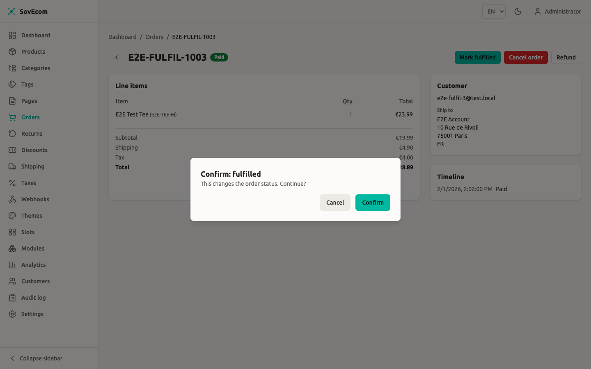
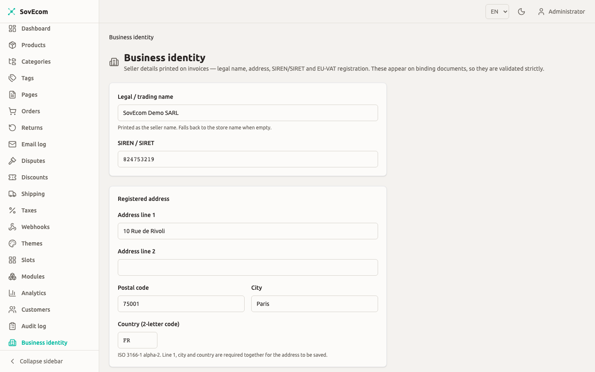

Your SovEcom store produces three fiscal documents: the legal invoice, the credit note, and the OSS export you file VAT against. This guide explains why your order numbers can skip values while your invoice numbers never can, what each invoice must legally carry, and how the One-Stop-Shop export feeds your quarterly return. The behavior here matches the API as shipped.

For the tax engine that computes VAT (rates, reverse charge, the €10,000 distance-sale threshold), see [Taxes & VAT](/operator-guides/tax/). For the refunds, returns, and 14-day withdrawal right that trigger credit notes, see [Order Management](/operator-guides/orders/).

:::caution[Legal wording is a vetted-pending default]
SovEcom ships a defensible default set of mandatory mentions and reverse-charge wording. The exact French *mentions légales*, the late-payment penalty text, and your numbering series strategy carry a `PENDING-accountant` flag in the code. Confirm them with your accountant before you rely on them in production. Treat the structure (which fields appear, the gapless guarantee, the regime branch) as binding and the precise legal strings as a starting point.
:::

## Order numbers gap; invoice numbers do not

SovEcom keeps two separate counters because they answer to two different masters.

| Artefact | Field | Gaps allowed? | When allocated |
|----------|-------|---------------|----------------|
| Order | `orders.order_number` (e.g. `FR2026-00042`) | Yes | Early, before payment, via a Postgres sequence |
| Invoice | `invoices.invoice_number` (e.g. `2026-000001`) | No, never | Only at issuance, after payment succeeds |

An order is a commercial record. A customer can start checkout, abandon it, or have a payment fail, and each of those burns an order number. That is fine. A gapless order counter would force you to hold a lock across the whole payment or fabricate filler orders, both worse than a harmless gap.

An invoice is a fiscal document. French CGI art. 242 nonies A and the EU VAT Directive (2006/112/EC arts. 220 to 230) require a continuous, gapless, chronological sequence per issuer. SovEcom enforces this with a dedicated counter table. A bare Postgres sequence will not do.

### How the gapless guarantee works

A plain Postgres sequence (`nextval()`) gaps on rollback: it hands out a number, and if the transaction aborts the number is gone. That is illegal for invoices. So `allocateGaplessNumber` locks a row in `invoice_counters` per `(tenant, series)` with `SELECT … FOR UPDATE`, reads `next_value`, hands it out, and increments, all inside the issuing transaction.

If that transaction rolls back, the increment rolls back with it and the number is not consumed. The next successful issuance reuses it. Concurrent issuers serialize on the row lock, so two orders paid at the same instant cannot both claim number 42.

:::note
You never set or edit an invoice number. The counter is allocated by the system at issuance and is immutable afterward. There is no admin field to override it.
:::

## When an invoice is issued

SovEcom issues the invoice for you. The service listens for the `order.paid` event and calls `issueForOrder`, which runs once per order:

1. It checks whether an invoice already exists for the order. If one does, it returns that one and stops. The flow is idempotent, so a retried or re-emitted `order.paid` never produces a second invoice or consumes a second number. A partial unique index is the race-proof backstop behind the cheap pre-check.
2. It refuses only a pre-payment order. The gate is the true invariant, money captured, rather than a strict `status === 'paid'` check. A paid order that already moved on to `fulfilled`, `shipped`, `delivered`, `completed`, `refunded`, or `partially_refunded` still gets its invoice. Only `pending_payment` is rejected with a `409 Conflict`.
3. In one transaction it allocates the gapless number, builds the immutable snapshots, and inserts the invoice row with `storage_key` null.
4. After the commit, it renders the PDF from the snapshot and attaches the storage key. This render is best-effort. If it fails, the invoice is still validly issued, and downloads render on demand from the snapshot.

### Immutability and the snapshot

Once issued, an invoice is frozen. SovEcom snapshots the seller identity, buyer identity, line items, tax breakdown, and totals into JSONB on the invoice row at issuance. A later change to your tax settings, business name, or the order never alters an issued invoice. A database trigger blocks every mutation except the one transition the render needs: setting `storage_key` from null to a value, exactly once.

This is why corrections are issued as a separate credit note (below) and never as an edit. You cannot delete an issued invoice either.

## Downloading invoices

Two endpoints serve the PDF. Both render on demand from the snapshot when the stored PDF is missing.

| Caller | Route | Permission / auth |
|--------|-------|-------------------|
| Admin | `GET /admin/v1/orders/:orderId/invoice` | `orders:read` |
| Customer | `GET /store/v1/orders/:orderId/invoice` | Customer JWT; the order must belong to the caller |

The customer endpoint runs an ownership check first. Another customer's order, a guest order, or an order with no invoice all return `404`, so an order id is never an enumeration oracle.



### Re-rendering a failed PDF

If a render failed at issuance, the invoice row carries `storage_key = null` and downloads still work (rendered live from the snapshot). To materialize and store the PDF, call the reissue endpoint:

```
POST /admin/v1/orders/:orderId/invoice/reissue
```

This needs `orders:write` and is audited as `invoice.reissued`. It never re-allocates a number or re-issues the fiscal document. It only renders from the persisted snapshot and attaches the PDF. The response carries `reissued` and `invoiceNumber`. An already-stored invoice returns `reissued: false`.

## What an invoice carries

Your tax mode picks one of two layouts off the same snapshot (see [Taxes & VAT](/operator-guides/tax/)).

- **`none` mode prints a receipt.** Net lines, totals, currency. No VAT column, no VAT breakdown, no SIREN/VAT on the seller block.
- **`eu_vat` mode prints a VAT invoice.** It adds a VAT column, a per-rate VAT breakdown, the seller's SIREN/SIRET and VAT number, the buyer's VAT number, and the mandatory mentions.

### Mandatory mentions (eu_vat)

A French/EU VAT invoice carries the following. SovEcom prints these from the snapshot:

| Field | Source |
|-------|--------|
| Seller identity + address | `tenants.settings.business_identity` |
| Seller SIREN/SIRET | `business_identity.siren` (printed only in `eu_vat`) |
| Seller VAT number | `settings.eu_vat_registration.vat_number` (printed only in `eu_vat`) |
| Buyer identity + address | Order billing address |
| Buyer VAT number (B2B) | `orders.vat_number` |
| Invoice number + issue date | The gapless counter + issuance timestamp |
| Per-line description, qty, unit price ex-VAT | Order line items |
| VAT rate + amount per rate | The per-rate breakdown |
| Totals ex-VAT / VAT / incl-VAT | Reconciled order totals |

:::caution[Configure your seller identity before going live]
SIREN/SIRET and VAT number print only when present in `tenants.settings`. If `business_identity.siren` or `eu_vat_registration.vat_number` is blank, the invoice omits them, and an EU VAT invoice missing the seller VAT number breaks compliance. Set these before you take real orders.
:::

Set your store's legal identity — name, address, SIREN/SIRET, and VAT number — on the **Business identity** screen. Invoice generation reads these for the mandatory legal mentions, so keep them accurate.



### Reverse charge (B2B intra-EU)

On a reverse-charge order, the VAT invoice charges 0% and prints the autoliquidation note plus the legal basis. The default wording is:

```text
Autoliquidation — VAT reverse charge. VAT to be accounted for by the recipient
(EU intra-community supply, Art. 196 Directive 2006/112/EC / CGI art. 283-2).
[PENDING-accountant: confirm exact legal basis]
```

The invoice also prints the **VIES consultation reference** as the justification for the 0% charge. SovEcom reads this from the order's snapshotted `vies_consultation_ref` first, then falls back to the customer's stored VIES proof, guarded by the order's VAT number so a since-re-validated number never prints a wrong reference. A guest order or a non-reverse-charge order prints no reference.

:::caution[The reverse-charge mention is a default]
The `[PENDING-accountant]` marker is in the rendered text on purpose. Replace the legal basis with your accountant's confirmed citation before issuing reverse-charge invoices in production.
:::

### The no-VAT mention (none mode)

In `none` mode the receipt prints a neutral default:

```text
Prices shown are final; no VAT is applied under the current tax regime.
[PENDING-accountant: confirm the applicable no-VAT mention, e.g. art. 293 B CGI]
```

A small merchant below the VAT threshold typically prints "TVA non applicable, art. 293 B du CGI". SovEcom does not hardcode that as binding. Confirm it with your accountant.

### Money is always integer cents

Every amount on an invoice is integer minor units plus a currency code, never a float. A hard guard runs at issuance. The rendered figures must reconcile to `order.total_amount`, the per-rate recap must total the order VAT, and each rate row must satisfy rate × base ≈ VAT within one minor unit of rounding tolerance. If reconciliation fails, issuance aborts, the transaction rolls back, and no number is consumed. SovEcom never persists a non-reconciling fiscal document.

## Credit notes (avoirs)

A refund that reduces a fiscal total produces a **credit note**. SovEcom never edits the original invoice for this. The original stays untouched.

A credit note:

- has its own gapless series, `CN`, allocated from a separate `invoice_counters` row, so it never collides with the invoice series (`STD`);
- links back to the original via `corrects_invoice_id` and prints "Corrects invoice: …";
- copies the original invoice's seller and buyer snapshots so the corrective document matches the document it corrects;
- carries positive amounts under the French *avoir* convention, and mirrors the original's VAT regime, so a reverse-charge order's credit note prints the autoliquidation note too;
- reconciles to the refund total rather than the order total: `Σ line net + shipping net + VAT == total`.

SovEcom issues the credit note inside the refund transaction. The PDF renders post-commit on the same best-effort path as invoices, and the document is titled **CREDIT NOTE**.

:::note[Edge case: a refund on an order with no original invoice]
If the original invoice failed to issue and a refund happens anyway, SovEcom still produces a valid credit note. It reconstructs the seller identity from the tenant and the buyer identity from the order rather than minting an empty document. In that rare case `corrects_invoice_id` is null and SovEcom surfaces the situation for manual reconciliation. Check that the original invoice exists before refunding when you can.
:::

## OSS export

The One-Stop-Shop export gives you the per-sale VAT data for your OSS return: cross-border B2C distance sales within the EU, on which you charged destination VAT.

### When the export has data

The export returns data only when **all** of these hold:

- your tax mode is `eu_vat` and your origin country is in the EU-27;
- your OSS posture is `above_or_opted_in` (you crossed the €10,000 distance-sale threshold or opted in). A `below_threshold` tenant charges origin VAT on the same sales and declares them in the domestic return, so it gets a header-only CSV;
- the order is B2C (`is_b2b = false`; B2B intra-EU is reverse charge, not OSS);
- the destination (shipping country) differs from your origin, and both are EU-27;
- the order is not cancelled and not soft-deleted;
- `placed_at` falls inside the `[from, to]` window.

For any tenant that fails the first two gates, the endpoint still returns a valid CSV with just the header row.

:::caution[OSS posture is a switch you set, and it changes VAT behavior]
SovEcom reads posture from `tenants.settings.oss_posture`. Set it to `above_or_opted_in` and the tax engine charges destination VAT on qualifying cross-border B2C sales, and those sales appear in this export. Flip it when you cross the €10,000 threshold or choose to opt in. See [Taxes & VAT](/operator-guides/tax/) for how posture drives the rate applied at checkout.
:::

### Running the export

```
GET /admin/v1/taxes/oss-export?from=2026-01-01&to=2026-03-31
```

This needs `settings:read`. The response is `text/csv; charset=utf-8` with `Content-Disposition: attachment; filename="oss-export.csv"`. A date-only `to` covers the whole closing day, inclusive to 23:59:59.999 UTC, so a quarter boundary captures every sale placed on the last day.

:::note
The OSS export (destination-country VAT totals for your quarterly One-Stop-Shop return) is produced via the admin API for a chosen date range. Pull it each quarter for your OSS filing.
:::

### Reading the CSV

The columns are stable:

| Column | Meaning |
|--------|---------|
| `order_number` | The commercial order reference |
| `placed_at` | ISO-8601 timestamp the order was placed |
| `destination_country` | Buyer's shipping country (the country whose VAT you owe) |
| `line_type` | `goods`, `shipping`, or `refund` |
| `net` | Net consideration, integer minor units (negative for `refund`) |
| `vat_rate` | The statutory destination rate as a fraction (goods/shipping); for a `refund` row it is the refund's effective ratio, a label, since the negative `vat_amount` is the authoritative figure |
| `vat_amount` | VAT, integer minor units (negative for `refund`) |
| `currency` | ISO 4217 code |

Each order emits its goods rows, then a single `shipping` row when shipping VAT exceeds zero. For EU distance sales, shipping VAT follows the goods rate and is declarable. Refunds issued in the window appear as negative `refund` rows attributed to the order's destination, so the period reconciles to VAT collected minus VAT refunded.

:::note
Refunds correct the period they were issued in, the standard credit-note treatment. A refund on a sale from a prior quarter appears in the quarter the refund was issued, not the quarter of the original sale. Reconcile by the issued period.
:::

## Quarterly VAT reporting

The OSS export is a convenience aid for your filing. It is not the filing itself. A practical quarterly flow:

1. **Confirm your posture for the quarter.** If you crossed €10,000 mid-quarter, your earlier sales may have been charged origin VAT and your later sales destination VAT. The export reflects your *current* posture point-in-time and does not retro-snapshot a mid-period switch, so review the CSV against your threshold-crossing date.
2. **Pull the OSS export** for the quarter window (`from` = first day, `to` = last day).
3. **Sum VAT per `destination_country`.** Goods plus shipping minus refunds gives net VAT collected per member state. That feeds the per-country lines of your OSS return.
4. **Handle domestic and below-threshold sales separately.** Sales charged origin VAT (you were `below_threshold`, or the sale was domestic) belong in your national VAT return, not the OSS return. They are not in this export.
5. **Reconcile against issued credit notes.** Every refund row should map to a `CN`-series credit note. The gapless `CN` series gives you a continuous audit trail.
6. **File through your OSS portal** by the deadline (OSS returns are quarterly in most member states). SovEcom does not submit on your behalf.

:::caution
SovEcom does not file or submit any VAT return. It produces the data; you (or your accountant) file it. There is no automated OSS submission in this version.
:::

## Factur-X and structured e-invoicing

SovEcom issues **human-readable PDF invoices** today. Structured e-invoicing is **planned and not yet shipped**.

Two delivery tracks exist:

- **Legal invoice generation (PDF, gapless number, mandatory mentions).** Shipped. This is what this guide documents.
- **Structured e-invoicing (Factur-X hybrid PDF/XML, Peppol, French PDP routing).** Planned for a future release. The invoice data model is built **Factur-X-ready**: the row carries the fields EN 16931 / Factur-X BASIC needs, so the structured serializer becomes an extension over existing data without a schema migration. The current PDF renderer produces a plain PDF. It does not yet produce a PDF/A-3 with embedded XML.

### French mandate dates

The dates below reflect the current DGFIP mandate schedule. They have moved before. Confirm against current DGFIP guidance at the time you act.

| Obligation | Who | Target date |
|------------|-----|-------------|
| Must be able to *receive* structured e-invoices | All French VAT-registered businesses | 1 September 2026 |
| Must *issue* structured e-invoices | Large + mid-size enterprises | 1 September 2026 |
| Must *issue* structured e-invoices | SMEs / micro | 1 September 2027 |

:::caution[The "receive" obligation is yours, not a SovEcom feature gap]
The September 2026 obligation to *receive* structured e-invoices is a merchant obligation on your business, independent of SovEcom's self-hosted invoice generation. Plan your receiving path, your PDP or accounting software, on that timeline. Track the SovEcom structured-issuance module for a future release if you need to issue Factur-X.
:::
