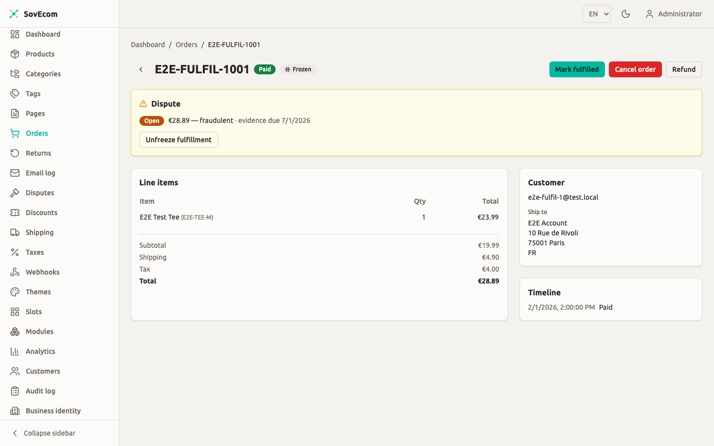
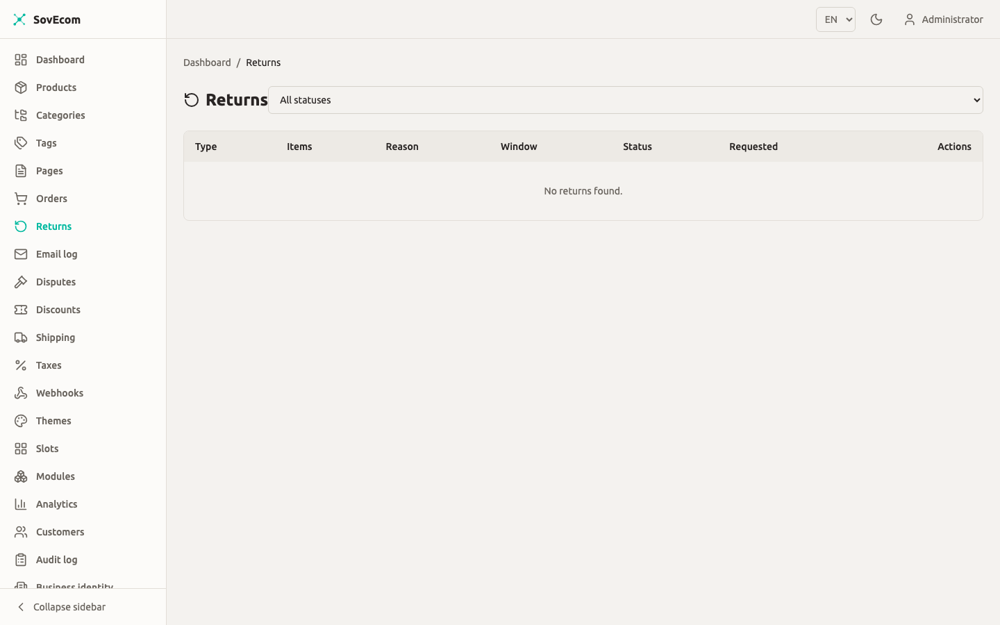

This guide covers the order side of running a SovEcom store: how an order moves through its states, how you fulfill and ship it, how customers exercise the statutory 14-day withdrawal right, and how refunds and credit notes work. The behavior here matches the API as shipped. Where a screen is not yet captured, you will see a screenshot placeholder.

For tax behavior on these orders (VAT, reverse charge, OSS), see [Taxes & VAT](/operator-guides/tax/). For payment setup, see [Payments](/operator-guides/payments/).

## The order lifecycle

Every order carries a `status` that moves through a fixed state machine. The machine defines what you can do: you cannot skip a state or move backward. The API rejects an illegal move with a `422 Unprocessable Entity` and leaves the order untouched.

### States

| Status | Meaning |
|--------|---------|
| `pending_payment` | Order created from the cart, awaiting payment. Stock is already reserved. |
| `paid` | Payment captured (or recorded as a manual/offline payment). |
| `fulfilled` | You marked the order ready (picked/packed). |
| `shipped` | Goods handed to the carrier. |
| `delivered` | Carrier confirmed delivery. This timestamp starts the 14-day withdrawal clock. |
| `completed` | Closed out. Terminal. |
| `cancelled` | Cancelled before payment. Terminal. |
| `refunded` | Fully refunded. Terminal. |
| `partially_refunded` | Part of the order has been refunded; the rest is still live. |

### Allowed transitions

```
pending_payment  → paid | cancelled
paid             → fulfilled | cancelled | refunded | partially_refunded
fulfilled        → shipped | refunded | partially_refunded
shipped          → delivered | refunded | partially_refunded
delivered        → completed | refunded | partially_refunded
partially_refunded → refunded | partially_refunded
```

`completed`, `cancelled`, and `refunded` are terminal, with no outgoing transitions. Once an order reaches `refunded` it is closed for good, so the API blocks you from reaching that state through the generic transition endpoint. See below.

:::note
`partially_refunded` is the only state that can transition to itself. Each additional partial refund keeps the order in `partially_refunded` until the cumulative refunded amount equals the order total, at which point it flips to `refunded`.
:::

### Driving a transition

You move an order one legal step at a time:

```
POST /admin/v1/orders/:id/transitions
{ "to": "shipped", "note": "Handed to DHL, tracking 00340..." }
```

This needs the `orders:write` permission (admin or owner; staff with `orders:read` can view but not move orders). Every transition is row-locked, validated, and written to an append-only `order_status_history` row with your user id and optional note, so the lifecycle is fully auditable.

Two destinations are blocked on this endpoint by design:

- `→ paid` is rejected. Use the payment-recording endpoints (below) so a real `payments` row is written and the in-flight-payment guard runs. A bare transition to `paid` would leave a paid order with no payment record.
- `→ refunded` and `→ partially_refunded` are rejected. Refunds move money and write a refund row plus a credit note, so they must go through the refunds endpoint. Reaching `refunded` here would block the real refund flow for good.


### Auto-cancellation of unpaid orders

A background sweeper cancels `pending_payment` orders whose payment never completed and releases the stock they hold. The default window is 60 minutes. Set `UNPAID_ORDER_TTL_MINUTES` to change it. SovEcom caps the value at 23 hours: the order id is the Stripe idempotency key and it expires near 24 hours, so cancelling well before that prevents a second live charge on a retry.

```bash
# Cancel unpaid orders older than 30 minutes
UNPAID_ORDER_TTL_MINUTES=30
```

The sweep is race-safe. It cancels an order only when its status is still `pending_payment` under a row lock, so a payment landing between the scan and the cancel can never cancel a just-paid order.

## Recording payment

For online payments (Stripe), the order moves to `paid` when the payment webhook confirms capture. For offline payments you record the payment yourself.

```
POST /admin/v1/orders/:orderId/payments
{ "method": "bank_transfer", "amount": 4999 }
```

`method` is one of `bank_transfer`, `cod` (cash on delivery), `cash`, or `other`. `amount` is integer minor units (cents); omit it to record the full order total. There is a convenience alias that always records the full amount:

```
POST /admin/v1/orders/:orderId/mark-paid
```

Both write a `payments` row and drive the order to `paid`. Both need `orders:write`.

:::caution
Money is always integer minor units plus a currency code. `4999` means €49.99 in a EUR order, never a float. Every amount you pass to a payment, refund, or shipping endpoint follows this rule.
:::

## Fulfillment and shipping

After an order is `paid`, you fulfill it by moving it through `fulfilled` → `shipped` → `delivered`. There is no separate fulfillment object in v1; fulfillment is the status transition plus your note (for example a tracking number).

### Shipping configuration

Shipping rates are store-wide settings under `orders:`/`settings:` permissions, not a per-order field. You define **zones** (named country groups) and **rates** within them.

```
GET/POST/PUT/DELETE  /admin/v1/shipping/zones
GET/POST/PUT/DELETE  /admin/v1/shipping/rates
```

Rate types:

| Type | Behavior |
|------|----------|
| `flat` | Fixed `amount` for the zone. |
| `free_over` | `amount`, waived once the cart subtotal reaches `freeOverAmount`. The `freeOverAmount` is mandatory for this type. |
| `weight_based` | Applies within `weightMinGrams`–`weightMaxGrams`. When both bounds are set, min must be ≤ max. |

Managing zones and rates needs `settings:write`. SovEcom recomputes the selected rate server-side at checkout. A rate that changed or fell out of zone since the customer picked it gets re-resolved, and the checkout is refused if it no longer applies. The cart value is never trusted.


### Disputed orders are frozen

When a payment dispute (chargeback) opens, SovEcom freezes the order's fulfillment. While it is frozen, the API refuses the `→ fulfilled` and `→ shipped` transitions with a `422`. Refunds and cancellation stay open, since a lost dispute still needs the order to resolve. Do not try to ship a disputed order. Resolve the dispute first.

When a dispute is open on an order, its detail shows a **fulfilment-frozen** banner and blocks *Mark fulfilled* until the dispute resolves.



## Returns and the 14-day withdrawal right

SovEcom distinguishes two return kinds (the `return_type` enum):

- **`return`**: a normal product return (defective, wrong item, change of mind on a specific line).
- **`withdrawal`**: the statutory 14-day right of withdrawal under the EU Consumer Rights Directive 2011/83/EU.

### How a customer requests a return

The customer initiates a return on **their own** order from the storefront account area:

```
POST /store/v1/customers/me/orders/:orderId/returns
{ "type": "withdrawal", "items": [{ "orderItemId": "…", "quantity": 1 }], "reason": "…" }
```

This is customer-authenticated and scoped to the logged-in customer. Another customer's order id returns `404`, with no way to tell "not found" from "not yours" (no enumeration oracle). The order must be in a returnable state: `paid`, `fulfilled`, `shipped`, `delivered`, or `partially_refunded`.

SovEcom checks each requested line against the not-yet-refunded quantity on that order item, so a customer cannot request more units than remain. This is a soft pre-check. The hard no-over-refund guard runs again at approval.

### The 14-day window flag

When a return is created, SovEcom computes a `withinWithdrawalWindow` flag from the order's **delivery** timestamp:

- If the order is not yet `delivered`, the window is **open** (the right has not started expiring).
- If it is delivered, the window is open until 14 days after the delivery timestamp, then closed.

```
withinWithdrawalWindow = (now ≤ deliveredAt + 14 days)  // open if not yet delivered
```

The flag is informational and rides on the return record, so at decision time you can see whether the customer is still inside the statutory window. SovEcom does not auto-reject a late request. You make the call.

:::caution
The 14-day withdrawal right applies to consumer (B2C) sales of eligible goods. Some goods are exempt (perishables, sealed health items unsealed after delivery, custom-made items). SovEcom records the window flag but does not classify exemptions for you. Apply your own legal policy when you approve or reject a `withdrawal` request.
:::

### Return statuses

| Status | Meaning |
|--------|---------|
| `requested` | Customer submitted it; awaiting your decision. |
| `approved` | You approved it; the refund is being issued. |
| `rejected` | You rejected it with a reason. |
| `refunded` | Refund issued and the return is closed. |

### Approving or rejecting a return

You work the return queue under `orders:read` (view) and `orders:write` (decide):

```
GET   /admin/v1/returns?status=requested
POST  /admin/v1/returns/:id/approve
POST  /admin/v1/returns/:id/reject   { "reason": "Outside the 14-day window" }
```

Approving a return does the whole money side in one step: it issues a refund, writes a credit note, restocks the returned goods, then marks the return `refunded`.

- A **full withdrawal** (every line, full quantity, nothing refunded yet) refunds in full **including shipping**. Under the Consumer Rights Directive, a withdrawal refunds the original outbound delivery cost.
- A **partial return** refunds the requested lines.

Approval is a compare-and-swap from `requested` to `approved`, so a double-click or concurrent approve cannot issue two refunds for one return. Each return carries a stable idempotency key (`return:<id>`), so a retried approve collapses into a single refund at the gateway. If the refund fails, the return reverts to `requested` and you can retry once you fix the cause.



## Refunds

You can also issue a refund without a return record (for a goodwill adjustment or a price correction). Refunds need `orders:write`, get audited, and drive the order to `refunded` or `partially_refunded`.

```
POST /admin/v1/orders/:orderId/refunds
```

There are three mutually exclusive modes:

| Mode | Body | Effect |
|------|------|--------|
| Full | neither `items` nor `amount`; optional `restock: true` | Refunds the entire remaining balance. `restock` returns all not-yet-refunded units to stock. |
| Line-item | `items: [{ orderItemId, quantity, restock? }]` | Refunds specific lines/quantities, with per-line restock. |
| Partial amount | `amount: <minor units>` | Refunds an arbitrary amount with proportional VAT reversal. |

`items` and `amount` cannot both be present. Every refund body must include a stable `idempotencyKey`:

```
POST /admin/v1/orders/:orderId/refunds
{
  "items": [{ "orderItemId": "…", "quantity": 1, "restock": true }],
  "reason": "Damaged in transit",
  "idempotencyKey": "refund-2026-06-25-damaged-01"
}
```

:::caution
The `idempotencyKey` is mandatory for any gateway (Stripe) refund and must stay **the same** across retries of the *same* logical refund. Send a key fixed for the whole attempt, so a lost response or a double-click reuses it and Stripe collapses the retries into one refund. Two genuinely different refunds (even same amount and reason) must carry **different** keys. There is no server-side fallback; a gateway refund without a key is refused rather than risk a double refund.
:::

### What a refund does, atomically

A refund runs as one order-row-locked transaction: lock the order, validate the amount against the refundable remaining, call the gateway, write the refund, increment the refunded amount, restock if asked, issue a credit note, and drive the order state. These commit or roll back together. Key guarantees:

- **No over-refund.** The refund is rejected if it exceeds the remaining (`total − already refunded`), and per-line refunds are re-checked against each item's not-yet-refunded quantity.
- **Tax reversal is exact.** VAT is reversed proportionally, clamped so the cumulative reversed tax can never exceed the order's VAT.
- **Manual payments** are recorded offline (no gateway call); you settle the money yourself through your bank or cash drawer.

### Asynchronous (SEPA) refunds

A refund against an async method (SEPA Direct Debit) can return `pending`: the money has not moved and the bank may still reject it. For a pending refund, SovEcom reserves the refunded amount and quantities, so a concurrent refund cannot over-refund, but **defers** the credit note, restock, and order-state change until the bank confirms. On confirmation it replays those steps once. If the bank rejects, it backs the reservation out and marks the refund `failed`. You see the refund as `pending` until then.

## Gateway (Stripe-dashboard) refunds are reconciled and audited

You can also refund directly in the Stripe Dashboard. SovEcom reconciles those back into the order via the `charge.refunded` / `refund.updated` webhooks:

- The webhook records the dashboard refund as an external, amount-mode refund, issues the credit note, restocks nothing (no line context), and drives the order state.
- It is idempotent on the Stripe refund id. If the refund is already recorded (admin-initiated, or a prior webhook), it is a no-op or a status update.
- A dashboard refund whose amount exceeds the remaining (already covered) is logged and skipped, not failed.

A dashboard refund runs with no admin user attached. To keep an audit trail, SovEcom writes a system-actor `order.refunded.gateway` entry to the audit log on reconciliation, recording the Stripe refund id, amount, and status. The payment-events ledger alone does not satisfy the audit export, so this entry is what surfaces a gateway refund in your audit query.

:::tip
Issue refunds from the SovEcom admin when you can. An in-app refund attaches your user id. A dashboard refund still reconciles and audits, but under the system actor, so the trail names "who" with less precision.
:::

## Credit notes

Every confirmed refund issues a **credit note**. The credit note corrects the order's original invoice; the original is never modified.

- Credit notes use their own gapless counter series, `CN`, separate from the `STD` invoice series. Each per-tenant series is gapless: a rolled-back transaction consumes no number.
- The number format is `YYYY-NNNNNN` (year of issuance, zero-padded sequence).
- A credit note is immutable once issued and links back to the invoice it corrects via `corrects_invoice_id`.
- The credit note carries the tax-reversal breakdown (net, VAT, gross) for the refunded lines or amount.

If the original invoice is missing when a refund runs (invoice issuance is a best-effort async step), SovEcom issues it first so the credit note has real fiscal identity and a corrects-link, rather than minting a credit note with empty seller/buyer data.

:::caution
Gapless numbering is a fiscal requirement in several EU jurisdictions. Do not attempt to delete or renumber credit notes. The exact legal series format for France carries a `PENDING-accountant` flag; confirm the format with your accountant before going live.
:::

SovEcom renders and stores the credit-note PDF after the refund commits. A failed render gets logged and does not roll back the refund. The credit-note record still exists, and you can re-render the PDF.

## Restocking

Restock behavior depends on how stock left in the first place:

- **Unpaid cancellation** (`pending_payment → cancelled`, by the sweeper or you): SovEcom restores the stock consumed at order creation. Bundle parent lines re-expand to their components.
- **Refund / return**: stock returns when you ask for it (`restock: true` on a full refund, or per-line `restock` on a line refund, which the return-approval flow sets). A full-refund restock returns the not-yet-refunded quantity, so a line already restocked by an earlier partial refund is never double-credited.

Cancelling a paid order does not restock through the cancel path. It restocks through the refund flow, so stock is never double-credited.

## Permissions summary

| Action | Permission | Roles |
|--------|------------|-------|
| View orders / returns | `orders:read` | staff, admin, owner |
| Transition, mark paid, record payment | `orders:write` | admin, owner |
| Issue refund | `orders:write` | admin, owner |
| Approve / reject return | `orders:write` | admin, owner |
| Manage shipping zones / rates | `settings:write` | admin, owner |

Staff can read the order and return queues but cannot move money or change order state. Every mutation is recorded in the audit log.
