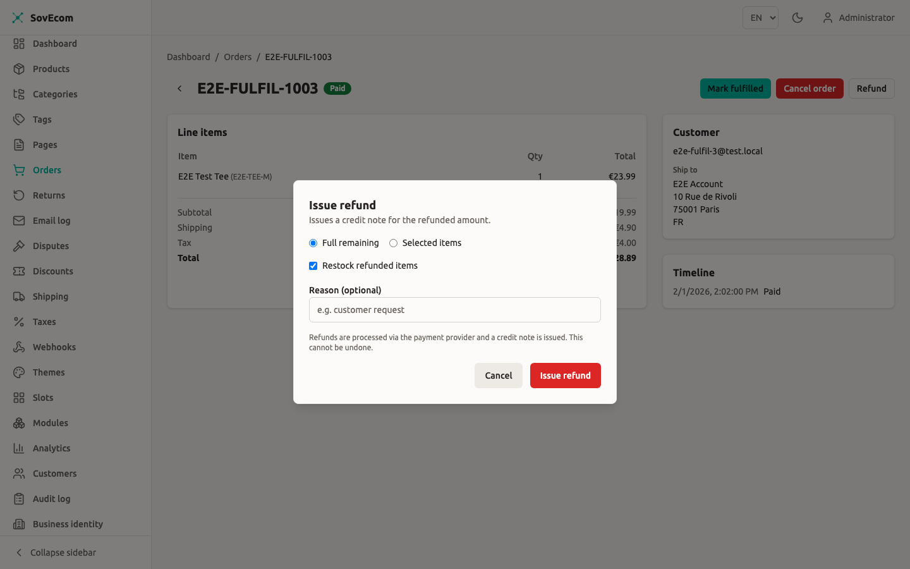
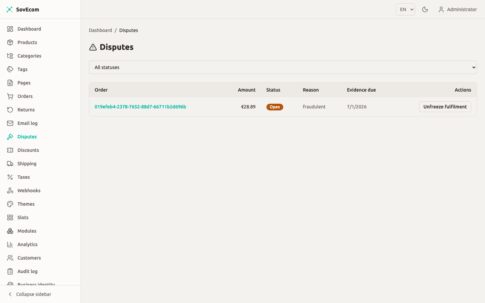

SovEcom collects money through one live gateway today: **Stripe**. The card number never touches your API. Stripe's hosted Payment Element collects the PAN in the customer's browser, so your store stays in **PCI SAQ-A** scope. Your server sees a payment-intent id, an amount in integer minor units, and a currency code.

This guide covers what ships in v1: the Stripe card flow, SEPA Direct Debit, Apple Pay and Google Pay (which ride the same Stripe Element), recording offline payments by hand, refunds with credit notes, and dispute handling. Where a feature is planned but not yet built, the page marks it.

:::note
Money in SovEcom is always an **integer count of minor units plus an ISO-4217 currency code** (1099 plus `EUR` means €10.99). No floats touch the money path. Every amount in this guide, and every amount the API returns, follows that rule.
:::

## What is implemented vs planned

| Capability | State | Notes |
|---|---|---|
| Stripe card payments | **Live** | Hosted Payment Element, SAQ-A, webhook-confirmed |
| SEPA Direct Debit | **Live** | Async clearing; order goes `paid` only when funds settle |
| Apple Pay / Google Pay | **Live** | No extra code; surfaced by the same Stripe Element |
| Manual / offline payments | **Live** | Recorded by an admin via the orders API |
| Refunds + credit notes | **Live** | Full, line-item, or partial-amount; gapless credit-note numbering |
| Disputes / chargebacks | **Live** | Recorded from Stripe; fulfillment auto-frozen on open |
| Mollie | **Planned** | Provider stub only; every method throws today |
| Redirect gateways (PayU, PayFast, Mollie hosted) | **Not yet available** | A redirect gateway requires additional work beyond the current provider seam and is not yet implemented |
| Admin screens for payments / refunds / disputes | **Planned** | The behaviour exists as API endpoints; no dedicated admin UI ships yet |

:::caution[No admin payment screens yet]
The refund, manual-payment, and dispute actions described below are **API endpoints**, not buttons in the admin app. A dedicated payments UI is planned for a future release. Until it lands, you drive these actions through the admin API (with an `orders:write` or `orders:read` permission) or whatever internal tool you build on top of it. The screenshot placeholders in this guide mark where those screens will appear.
:::

## Adding another gateway is a core integration, not a module

This is the most-asked question, so it gets answered up front. If a client needs a regional gateway (PayU, PayFast, Mollie, anything), you **cannot** add it as a sandboxed module. The module sandbox is never granted a payment capability, by design. Untrusted third-party code never sits on the money path, and that posture is permanent.

A new gateway is a **trusted core integration**. You implement the `PaymentProvider` interface, register it in the dependency-injection container, and add a webhook controller. For a Stripe-shaped gateway (one that returns a client secret for an in-page Element) that is roughly one to two days of work and touches no checkout logic. A **redirect** gateway (where the customer leaves your site to a hosted page) is larger: the current provider seam returns a `clientSecret`, but a redirect gateway needs a `redirectUrl` plus its own webhook signature scheme. That work is not yet implemented.

The storage already supports this. The `payments` table is provider-agnostic (`provider`, `provider_payment_id`, `method`, `metadata`), and webhook de-duplication keys on `(provider, event_id)`. A second provider corners nothing in the database.

## Configuring Stripe

You wire Stripe from environment variables. When `STRIPE_SECRET_KEY` is absent the app still boots (handy for local dev and tests), and every payment call returns **503 Service Unavailable** instead of silently doing nothing. You will see this warning in the logs at startup:

```
Stripe disabled — no STRIPE_SECRET_KEY configured; payments will 503
```

Set these on the API process:

```bash
# Server-side secret key (sk_live_… / sk_test_…). NEVER expose this to the browser.
STRIPE_SECRET_KEY=sk_live_xxx

# Webhook signing secret (whsec_…). Without it, EVERY webhook is rejected (fail-closed).
STRIPE_WEBHOOK_SECRET=whsec_xxx

# Optional: pin the Stripe API version. Defaults to the version the SDK is typed against.
STRIPE_API_VERSION=2026-05-27.dahlia
```

The storefront needs the **publishable** key, and only that:

```bash
# Storefront (Next.js): publishable key only. Safe to ship to the browser.
NEXT_PUBLIC_STRIPE_PUBLISHABLE_KEY=pk_live_xxx
```

:::caution[Keep the secret key off the browser]
The secret key (`STRIPE_SECRET_KEY`) belongs to the API process alone. The storefront uses `NEXT_PUBLIC_STRIPE_PUBLISHABLE_KEY`, which is publishable by design. Never put a secret key behind a `NEXT_PUBLIC_` variable. SovEcom never logs the secret key, client secrets, signatures, or card data.
:::

The code pins the Stripe API version (`2026-05-27.dahlia`) so a server-side Stripe upgrade can't change behaviour underneath you. Override it through `STRIPE_API_VERSION` only when you deliberately bump it, the same way you would any dependency. Stripe telemetry is off (the EU-privacy default).

### Point Stripe at your webhook

The webhook is the **source of truth** for "this order is paid". Not the browser, not the success page. In your Stripe Dashboard, add an endpoint pointing at:

```
POST https://your-store.example.com/webhooks/stripe
```

Subscribe it to at least these event types:

| Event | What SovEcom does |
|---|---|
| `payment_intent.succeeded` | Marks the payment succeeded, drives the order to `paid`, issues the invoice |
| `payment_intent.processing` | Records an async (SEPA) payment as `processing`; the order stays `pending_payment` |
| `payment_intent.payment_failed` | Marks the payment `failed`; the order stays payable so the customer can retry |
| `charge.dispute.created` / `.updated` / `.closed` | Records the dispute; freezes fulfillment on open |
| `refund.created` / `refund.updated` | Reconciles a Stripe-dashboard or async refund |
| `charge.refunded` | Fallback for older API versions that embed the refunds list |

Copy the endpoint's signing secret into `STRIPE_WEBHOOK_SECRET`. SovEcom verifies every inbound request against it using the raw request body. An unsigned or forged request gets rejected with **400** and changes nothing. A missing signing secret means SovEcom rejects everything, by design.

:::tip[Test the webhook before going live]
Use the Stripe CLI to forward events to your local API while you verify the flow:
`stripe listen --forward-to localhost:3000/webhooks/stripe`. The CLI prints a temporary `whsec_…` to use as `STRIPE_WEBHOOK_SECRET`.
:::

:::note[Card-testing protection]
The public payment-intent endpoint is a classic card-testing target. SovEcom rate-limits it per-IP and per-cart (a Redis fixed-window limiter that fails closed), returns only opaque error messages, and expects you to enable **Stripe Radar** on the account. You configure Radar in the Stripe Dashboard. It is not a toggle inside SovEcom.
:::

## How a Stripe payment flows

You don't drive this by hand. It runs on the storefront checkout path. Knowing the sequence helps when you reconcile an order.

1. The customer reaches checkout. The storefront calls `POST /store/v1/carts/:cartId/payment-intent`. SovEcom authorises that the caller owns the cart (cart cookie or customer JWT), turns the cart into an order in `pending_payment` (stock is consumed at this point), creates a Stripe PaymentIntent for the **server-computed order total**, and returns a `clientSecret`.
2. The browser confirms the payment with Stripe's hosted Payment Element. The card number goes straight to Stripe. Your API never sees it.
3. Stripe sends `payment_intent.succeeded` to your webhook. SovEcom verifies the signature, drives the order from `pending_payment` to `paid`, and issues the invoice exactly once.

The amount charged is always `order.total_amount` in the order's currency, computed on the server. SovEcom never trusts a client-supplied amount. The Stripe idempotency key for the intent is the order id, so a retried create returns the same intent and never double-charges.

:::note
Because SovEcom consumes stock when the payment intent is requested, an abandoned checkout holds stock in a `pending_payment` order until a sweeper cancels it. See [Unpaid-order cleanup](#unpaid-order-cleanup) below.
:::

:::note
With Stripe configured, the storefront checkout renders the **Stripe Payment Element** (card, and the wallet/local methods you enable in Stripe). The store never sees raw card data — that keeps you in PCI SAQ-A scope.
:::

## SEPA Direct Debit

SEPA rides the same Stripe Element. Enable SEPA Direct Debit on your Stripe account and offer EUR, and that is the whole setup. The difference is timing. SEPA confirms instantly but **clears over days** and can fail after acceptance. SovEcom never fulfils before the money is in.

- When Stripe sends `payment_intent.processing`, SovEcom records the payment as `processing` and leaves the order in `pending_payment`. The storefront shows a "payment processing" state.
- When the funds clear, `payment_intent.succeeded` drives the order to `paid` and issues the invoice, exactly like a card.
- If clearing fails, `payment_intent.payment_failed` marks the payment `failed` and the order stays payable for a retry.

A `processing` SEPA order is **shielded from the unpaid-order sweeper**, so it won't be cancelled while clearing (which can legitimately take days).

## Apple Pay and Google Pay

Both ride Stripe's `automatic_payment_methods` on the same Payment Element. There is **no SovEcom code** for them and nothing to configure in the admin. Stripe surfaces the wallet button based on the customer's browser and device capability plus your Stripe account configuration. Enable Apple Pay and Google Pay in your Stripe Dashboard and register your domain there. The buttons then appear in the storefront's existing Element.

## Manual and offline payments

For bank transfer, cash on delivery, or cash at pickup, an admin records the payment by hand. The call writes a real `payments` row and drives the order to `paid`, so the invoice issues and the order behaves like any other paid order. Two endpoints, both requiring `orders:write` and both audited:

```http
POST /admin/v1/orders/:orderId/payments
Content-Type: application/json

{ "method": "bank_transfer", "amount": 4990 }
```

`method` is one of `bank_transfer`, `cod`, `cash`, or `other`. `amount` is optional integer minor units; omit it to use the full order total (the common "mark fully paid" case).

A convenience alias marks the full amount paid with `method: "other"`:

```http
POST /admin/v1/orders/:orderId/mark-paid
```

Both paths refuse to over-pay or double-pay. The amount must equal the order total (v1 has no partial-payment model), and the order must be in `pending_payment`. Recording a payment on an already-paid or cancelled order returns **409 Conflict**. If a SEPA payment is mid-clearing on the same order, SovEcom refuses the manual record so the two can't both collect.

:::note
For the manual/offline payment method, an unpaid order's detail shows a **Record offline payment** action; recording it marks the order paid and releases it to fulfilment.
:::

:::caution[The Manual provider is offline-only]
The `manual` provider has no online "create an intent" path. It exists only to record a payment that already happened off-platform (a transfer you saw land in your bank). Calling it for an online charge throws `NotImplementedException`. That is intentional.
:::

## Refunds and credit notes

You issue a refund against an order's captured payment. SovEcom calls Stripe (or records an offline refund for a manual payment), issues a **credit note** with gapless numbering that corrects the original invoice, optionally restocks, and drives the order to `refunded` or `partially_refunded`. The money, the credit note, and the order state all commit together or roll back together.

```http
POST /admin/v1/orders/:orderId/refunds
Content-Type: application/json

{
  "amount": 1500,
  "reason": "Damaged on arrival",
  "idempotencyKey": "refund-<orderId>-2026-06-25-a"
}
```

Requires `orders:write`. Audited. Three mutually exclusive modes:

| Mode | Body | Effect |
|---|---|---|
| **Full** | neither `items` nor `amount` | Refunds the entire remaining balance. Add `"restock": true` to restock every unrefunded line |
| **Line-item** | `items: [{ orderItemId, quantity, restock? }]` | Refunds named lines by quantity; per-line restock |
| **Partial-amount** | `amount: <minor units>` | Refunds an arbitrary amount; no restock |

:::caution[idempotencyKey is mandatory and must be stable]
Every refund request **must** carry a stable `idempotencyKey`. Reuse the same key for retries of the same logical refund (a double-click, a lost response, a transport retry) so Stripe collapses them into one refund and you never move money twice. Two genuinely separate refunds, even for the same amount, must carry **different** keys. There is no server-derived fallback. SovEcom rejects a request without a key, because a generated key would shift once a prior refund committed and a retry could mint a second real refund.
:::

SovEcom computes the tax reversal per mode. Line refunds use cumulative-remainder rounding so the sum across all units equals the line's exact paid tax, with no rounding drift that could over-reverse VAT. Partial-amount and full refunds reverse tax proportionally, clamped so the reversed tax can never exceed the order's original VAT. A refund can never exceed the refundable remaining balance. An over-refund request returns **422**.

### Refunds initiated in the Stripe Dashboard

If you refund directly in Stripe's own dashboard, the `refund.created` / `charge.refunded` webhook reconciles it back into SovEcom. SovEcom records the refund, issues the credit note, restocks nothing (amount-mode), drives the order state, and writes a system-actor audit entry. A dashboard refund and an API refund converge on the same records. Reconciliation is idempotent on the Stripe refund id, so the echoing webhook of an API-initiated refund is a no-op.

### Async (SEPA) refunds

A SEPA refund comes back **pending**. The money hasn't moved and the bank may still reject it. SovEcom reserves the refunded amount (so a concurrent refund can't over-refund) but **defers** the irreversible parts (the credit note and the order-state change) until Stripe confirms the refund succeeded. If the refund later fails, SovEcom backs out the reservation and never issues a credit note. A confirmed succeeded refund replays the deferred effects exactly once.



## Disputes and chargebacks

When a cardholder disputes a charge, Stripe sends `charge.dispute.created`. SovEcom records the dispute against the order and payment, captures the evidence-due-by date, and **freezes fulfillment** on the order. While an order is frozen, SovEcom refuses its `fulfilled` and `shipped` transitions (**422**), so a disputed order can't ship out from under you.

The dispute outcome (`won` / `lost`) is webhook-driven only. Stripe is the source of truth, and `won` / `lost` are terminal. SovEcom never lets a redelivered or out-of-order event regress a resolved dispute or re-freeze an order you already unfroze. A lost dispute reconciles its money through the refund path.

Read and act on disputes through the admin API:

```http
# The dispute queue. Filter by status or order. Needs orders:read.
GET /admin/v1/disputes?status=open

# Clear the fulfillment freeze a dispute placed on its order. Needs orders:write. Audited.
POST /admin/v1/disputes/:id/unfreeze-fulfillment
```

:::caution[Unfreezing is a deliberate human action]
SovEcom freezes an order when a dispute opens but **never auto-unfreezes**. You clear the freeze yourself, through the unfreeze endpoint, once you've decided it's safe to ship. There is no automatic release.
:::

:::note
Gather and submit your dispute evidence in the **Stripe Dashboard**. SovEcom records the dispute and protects the order; it does not yet provide an in-app evidence-submission screen.
:::

Open disputes appear in the **Disputes** queue (*Disputes* in the sidebar) with the order, amount, reason, and evidence-due date. A Stripe `charge.dispute.created` webhook records the dispute and **freezes the order's fulfilment** so it cannot ship. When the dispute resolves, use **Unfreeze fulfilment** to release the order.



## Unpaid-order cleanup

Because SovEcom consumes stock when a payment intent is created, an abandoned checkout holds stock in a `pending_payment` order. A scheduled sweeper cancels orders that have sat unpaid past a TTL and **restores their stock**. Tune the window with:

```bash
# Minutes a pending_payment order may sit before the sweeper cancels it. Sensible default applies.
UNPAID_ORDER_TTL_MINUTES=60
```

The sweeper skips any order with a `processing` or `succeeded` payment, so an in-flight SEPA order is never cancelled while clearing. SovEcom clamps the TTL below the Stripe idempotency-key lifetime (about 24 hours), so a stale order is always cancelled before a second live charge could be created against it.

## Security and reconciliation notes

- **SAQ-A scope.** The card PAN is collected only by Stripe's hosted Element in the browser. No custom card form, no PAN at your API, no raw-card logging. Keep it that way; adding a custom card form would change your PCI scope.
- **Webhook is truth.** Order `paid` state is set by the verified webhook, never by the browser's success redirect. A customer who fakes a success page does not get a paid order.
- **Watch the logs for loud lines.** SovEcom surfaces a handful of rare races as **error** logs for you to reconcile by hand: a payment captured for a cancelled order (`PAYMENT CAPTURED FOR CANCELLED ORDER`), a double collection on one order, or a gateway refund whose order has gone missing. These need a manual refund or reconciliation. SovEcom logs them precisely so you catch them.

## Related guides

- [Tax configuration](/operator-guides/tax/): VAT, reverse charge, and how tax flows into invoices and credit notes.
- [Shipping configuration](/operator-guides/shipping/): zones and rates that feed the order total Stripe charges.

SovEcom treats the Stripe webhook as the source of truth for payment state. Payment gateways are trusted core integrations, never sandboxed modules — untrusted third-party code is never granted access to the money path.
