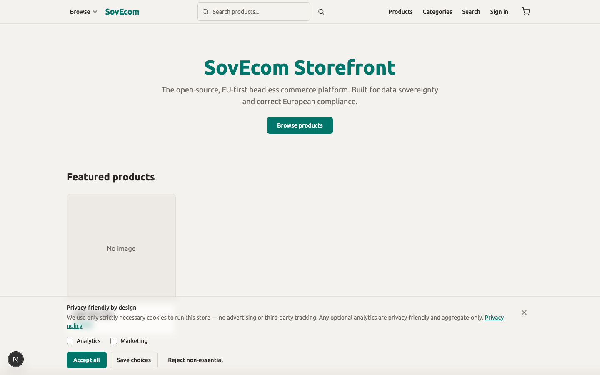

You run a SovEcom store in the EU, so you are the data controller for every customer record it holds. This guide covers the four things you act on: cookie consent on the storefront, the data-export and erasure paths your customers and your staff use, the retention windows SovEcom enforces, and the records you keep on paper to satisfy an audit. Every behavior below comes from the code as it ships.

Read the scope rule first. Self-hosting makes you the **controller** in GDPR terms. SovEcom the project ships software, runs none of your data, and acts as a processor only on the managed Cloud (covered at the end). The controller-versus-processor split decides who answers a regulator, so read [Controller vs processor](#controller-vs-processor) before you publish a privacy notice.

## Cookie consent

The storefront ships a consent gate that blocks trackers until the visitor opts in. Three tiers decide what loads:

| Category | Example | Consent needed | Behavior |
| --- | --- | --- | --- |
| Strictly necessary | session, cart, CSRF, the consent cookie itself | None | Always loads |
| Analytics | Google Analytics 4 | Opt-in (`analytics`) | Loads only after the visitor ticks it |
| Marketing | Meta Pixel | Opt-in (`marketing`) | Loads only after the visitor ticks it |

Plausible sits outside this table. It is cookieless, so it loads whenever you set a Plausible domain and ignores the consent state. GA4 and Meta Pixel check that state on every render.

Both analytics categories default to **off**. The banner shows only while the visitor has made no decision, and it renders after hydration so a returning visitor never sees a flash. Clicking "Reject" or the close (X) button records both categories off, "Accept all" records both on, and "Save" records what the visitor ticked.

The visitor's choice lives in a first-party cookie named `cookie_consent`, with a one-year `max-age`, `SameSite=Lax`, and `Secure` on HTTPS. The value is compact: `a1m0` means analytics on, marketing off. No third party reads this cookie.



### Withdrawal has a sharp edge

A returning visitor re-opens the banner through a "Manage cookies" control to change a recorded decision. Granting a new category takes effect in place, with no reload. Revoking a category that already loaded works differently. `next/script` cannot unload a running GA4 or Meta SDK, so the banner forces a full page reload to clear it. No in-session withdrawal stops an already-running tracker without that reload. Document this in your privacy notice if you list a "withdraw consent" mechanism.

### Turning analytics on

You configure Plausible, GA4, and Meta Pixel in your active theme's analytics settings, not in storefront environment variables. The storefront reads the analytics block from `GET /store/v1/theme` and passes the Plausible domain, GA4 id, and Meta Pixel id to the consent-aware loader. Leave a field blank and that tracker never loads, whatever the consent state.

:::caution
GA4 and Meta Pixel send personal data to third countries and need a lawful basis plus a transfer mechanism. They ship **off** for a reason. If you switch either on, update your privacy notice, your Article 30 record, and your consent banner text first. Plausible avoids the cookie-consent requirement, not the privacy-notice requirement.
:::

## Data export (Art. 15 / 20)

A signed-in customer exports their own data from **Account → Privacy** on the storefront. The export is a JSON document the customer downloads. It carries the disclosure a subject-access request demands under Article 15, in the portable JSON form Article 20 asks for.

The export discloses every category of personal data the store holds about that customer. Allowlist serializers build it, so no other customer's data and no internal columns leak:

| Section | Fields disclosed |
| --- | --- |
| `profile` | id, email, name, phone, B2B flag, VAT number, VAT-validated flag, marketing flag, created-at |
| `addresses` | every saved address |
| `orders` | order number, status, currency, order email, money totals (integer minor units), the shipping and billing address snapshots, line items |
| `invoices` | type, series, invoice number, currency, total, tax, reverse-charge flag, issued-at |
| `emailLogs` | recipient, type, subject, status, sent-at, created-at (metadata only, never the message body) |

The 2026-06-18 fix added the orders, invoice-metadata, and email-metadata sections so the export discloses everything the erase path scrubs. Money stays in integer minor units plus a three-letter currency code, never a float.

### Step-up password check

The export endpoint is `POST /store/v1/customers/me/rgpd/export`. It uses POST so it can carry the customer's **current password** in the body (ruling A). The server verifies that password with argon2id before it discloses anything. A wrong password returns 401 and exports nothing. The path allows 5 attempts per minute per IP and customer, and it fails closed, so it never becomes a password oracle.

Every successful export writes a `customer.data_exported` audit row, with the customer as actor. The audit log lets you prove you honored a request.

:::note
No admin "export this customer's data" button exists today. An admin handling a subject-access request on a customer's behalf relies on the customer's own self-service export, or queries the database directly. Flag this in your DSAR procedure.
:::

## Data erasure / pseudonymization (Art. 17)

SovEcom does not hard-delete a customer. It **pseudonymizes**. The row stays, scrubbed of every identifier, so the order and invoice history a tax authority can demand survives while the person becomes unidentifiable. This is the Article 17(3)(b) carve-out, where erasure does not override a legal retention obligation.

Two paths trigger it, both irreversible:

- **Customer self-service** — `POST /store/v1/customers/me/rgpd/erase` from **Account → Privacy**, gated by the same step-up password check and rate limit as export.
- **Admin** — `DELETE /admin/v1/customers/:id`, behind the admin JWT guard and the customer-delete permission. The admin must echo the target's **current email** exactly in `confirmEmail`; a mismatch or a missing value returns 400 and erases nothing.

After either path, the customer can no longer log in.

### What one erase transaction does

The erase runs as a single database transaction. If any step fails, the whole thing rolls back, and an irreversible erase never commits unaudited:

1. Set `anonymized_at` and `deleted_at` to now, set `email` to `anonymized-{uuid}@deleted.local`, and null out `name`, `phone`, `password_hash`, and `totp_secret`. This shape satisfies the `customers_anonymized_chk` constraint.
2. Scrub the VAT number, VAT-validated flags, and the `vat` metadata key from the stub.
3. Delete every saved address row.
4. On the customer's orders, replace the email with the anonymized address and collapse each shipping and billing address snapshot to its country only, with an `erased` flag. The order row survives as a commercial record.
5. Scrub the recipient on every transactional email logged to that address, matched case-insensitively.
6. Revoke every active session so a pre-erase token stops working.
7. Hard-delete the customer's email-change tokens, each carrying a third party's email, and the password-reset tokens.
8. Write a `customer.erased` audit row in the same transaction, recording whether it ran via `self` or `admin`.

:::caution
The erase leaves the immutable invoice snapshot untouched, by design. An issued invoice is a legal fiscal document, and the database blocks any DELETE or UPDATE on it. The buyer name and address that the law requires on the invoice stay there for the full fiscal retention period, under the legal-obligation basis of Article 17(3)(b). State this in your privacy notice: you cannot erase a customer's invoices on request.
:::


## Retention schedule

SovEcom enforces several windows automatically. Two of them, orders and invoices, it does **not** auto-purge, because they sit under a fiscal obligation you must honor for the full period.

| Data | Window | Mechanism |
| --- | --- | --- |
| Invoices | Fiscal retention (e.g. 10 years in FR/DE) | Immutable; DB blocks DELETE and UPDATE. No auto-purge. You hold them for the legal period. |
| Orders | Same fiscal period as invoices | Retained as commercial records; PII scrubbed on erase. No auto-purge. |
| Audit log | ≥ 2 years (NFR-SEC-003) | `tenant_id` is RESTRICT, so a tenant with audit rows cannot be hard-deleted. No auto-purge. |
| Carts (guest) | 7 days | Each cart carries an `expires_at` set at creation (7 days for a guest). The daily cleanup cron deletes Postgres carts past `expires_at`. Redis TTL is 8 days (7-day expiry + 1-day buffer). |
| Carts (registered) | 30 days | Same `expires_at` mechanism, set to 30 days for a logged-in customer, purged by the same daily cron. |
| Credential tokens | 7-day grace past expiry | `TokenRetentionSweeperService`, daily at midnight, hard-deletes dead email-change and password-reset token rows. |
| Stale unpaid orders | 60 min (default) | `StaleOrderSweeperService`, every 10 minutes, cancels `pending_payment` orders and releases their stock. |

:::caution
The 10-year figure is the common French and German fiscal retention period for invoices. SovEcom hard-codes no such constant. It keeps invoices forever (immutable, never auto-purged) and leaves the deletion-after-the-legal-period decision to you. Confirm the exact period your jurisdiction requires. No cron deletes an invoice after 10 years; that purge, if you run it, is a manual task you perform once the obligation lapses.
:::

### Tuning the windows you can tune

The token-retention grace reads `TOKEN_RETENTION_DAYS`, default 7, clamped to 1–90:

```bash
# apps/api environment
TOKEN_RETENTION_DAYS=7
```

The stale-order window reads `UNPAID_ORDER_TTL_MINUTES`, default 60, clamped to a maximum of 23 hours:

```bash
# apps/api environment
UNPAID_ORDER_TTL_MINUTES=60
```

The cart expiry windows (7 days guest, 30 days registered) and the cart Redis TTL are constants in the cart code, not environment variables. Treat every auto-purge job as steady-state hygiene, never as your GDPR erasure mechanism. Erasure is the pseudonymization transaction above.

## Article 30 processing record

As controller you keep a record of processing activities. SovEcom does not generate it. The template below seeds it with what a default SovEcom store does. Fill in your legal entity, adjust the trackers you enabled, and review it whenever you add a module that processes personal data.

| Activity | Purpose | Legal basis | Categories | Recipients | Retention |
| --- | --- | --- | --- | --- | --- |
| Account management | Operate customer accounts | Contract | Identity, contact, credentials | None | Until erasure |
| Order & invoice processing | Fulfil and bill orders | Contract; legal obligation (invoices) | Identity, contact, address, order, fiscal | Payment processor, carrier | Fiscal period for invoices/orders |
| Transactional email | Order and account notifications | Contract | Email, message metadata | Email provider | Per email-log retention |
| Login security | Lockout, audit, fraud prevention | Legitimate interest | IP, user agent, auth events | None | Audit ≥ 2 years |
| Plausible analytics | Aggregate, cookieless traffic stats | Legitimate interest | Truncated/aggregated only | Plausible (self-host to keep in-house) | Per Plausible config |
| GA4 (if enabled) | Web analytics | Consent | Device, behavior, identifiers | Google (third country) | Per GA config |
| Meta Pixel (if enabled) | Marketing measurement | Consent | Device, behavior, identifiers | Meta (third country) | Per Meta config |

:::tip
Keep this record next to your privacy notice and your DPA folder, version it, and date every change. A regulator can ask for it without notice, and "we ship open-source software that supports GDPR" is not a record of *your* processing.
:::

## Controller vs processor

The split changes with how you run SovEcom.

**Self-hosted (this guide).** You install and operate the software on your own infrastructure. You decide why and how customer data is processed, so you are the **controller**. SovEcom the project supplies code under AGPL-3.0 and touches none of your data. Every sub-processor you wire in (payment processor, email provider, carrier, GA4, Meta) is *your* processor, and you need a data-processing agreement with each.

**Managed Cloud.** SovEcom operates the infrastructure and processes data on your instructions. There, SovEcom is the **processor** and you remain the controller. A DPA between you and SovEcom governs that relationship, lists sub-processors, and sets breach-notification timelines. A future multi-tenant cloud will use the `tenant_id` threaded through every query to isolate one processor across many controllers.

Either way you are the controller toward your customers. The processor designation describes who runs the metal.

## Breach response

You have 72 hours from becoming aware of a personal-data breach to notify your supervisory authority (Article 33), and you tell affected individuals without undue delay when the risk to them is high (Article 34). Prepare before you need it:

1. **Detect and contain.** Pull the audit log first. It records actor, IP, user agent, and timestamp for security-relevant actions and is retained at least two years, so it is your primary forensic source.
2. **Assess scope.** Work out which tenants, which customers, and which categories are affected. Self-hosted means you own this assessment end to end.
3. **Notify the authority within 72 hours** if the breach is likely to risk individuals' rights. Record what you sent and when.
4. **Notify individuals** when the risk is high. The audit log and the erasure records help you scope the affected set.
5. **Record the breach** in your internal register whether or not you notified. The register is itself an accountability obligation.

On the managed Cloud, your DPA sets how fast SovEcom-the-processor must alert you so your own 72-hour clock can start. Self-hosted, no upstream processor alerts you; you are the first and last line.

## Data-processing agreements

A DPA is the Article 28 contract every controller-processor relationship needs.

- **Self-hosted:** you sign a DPA with each of your own processors (payment, email, carrier, any analytics you enabled, your hosting provider). Keep them in one folder you can produce on request.
- **Managed Cloud:** you sign a DPA with SovEcom, who is then your processor. That agreement lists SovEcom's sub-processors and the breach-notification timeline.

:::tip
Map your processors to the Article 30 table above before you draft a privacy notice. Every recipient in that table is a relationship that needs a DPA, and a missing one is the gap an audit finds first.
:::

## Related guides

- [Customer Management](/operator-guides/customers/) — the account, VAT-validation, lockout, and RGPD endpoints in full.
- [Orders](/operator-guides/orders/) — order lifecycle and the records erasure preserves.
