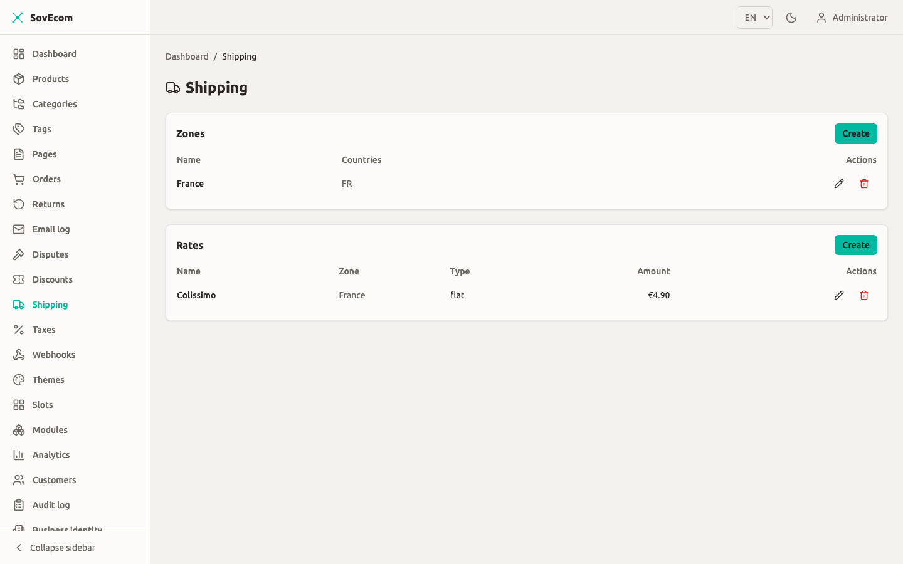
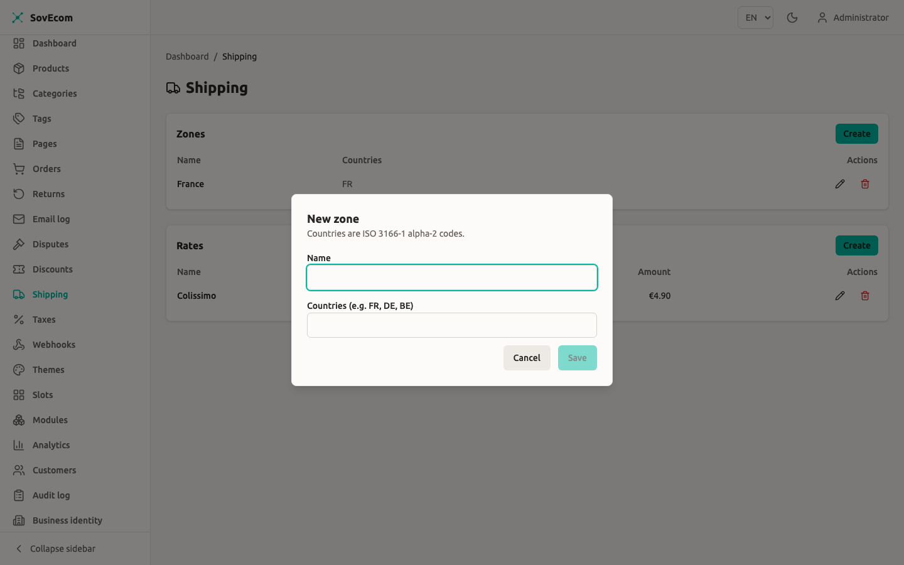
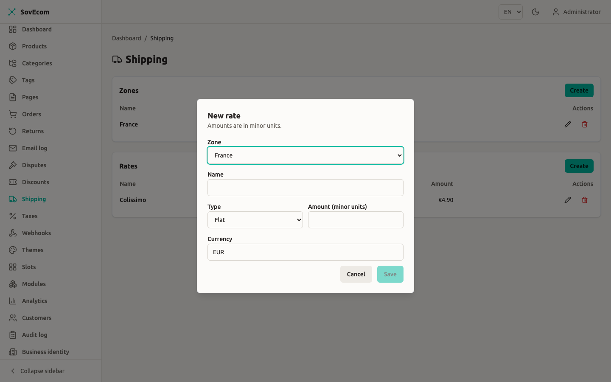

import { Aside } from '@astrojs/starlight/components';

You configure shipping from two things: **zones** (named groups of destination countries) and **rates** (the cost rules inside a zone). At checkout SovEcom takes the customer's shipping-address country, finds the zones that cover it, computes each rate's cost for that cart, and offers the applicable ones cheapest first.

You manage both from **Admin → Shipping**.



## How shipping resolves at checkout

The flow is deterministic. For a given cart SovEcom:

1. Reads the **shipping-address country**. With no address yet, no zone resolves, so the cart shows zero rates.
2. Collects every zone whose country list contains that country. Matching is case-insensitive on the ISO 3166-1 alpha-2 code.
3. Keeps only the rates whose **currency equals the cart currency**. A rate in a different currency never appears and never sums into the order total.
4. Computes each surviving rate's cost against this cart: subtotal after discounts, and total weight.
5. Drops any weight-based rate whose band the cart misses, then **sorts by computed cost ascending, then by name**.

The customer picks one of the offered rates. That rate's cost becomes the cart's `shippingAmount` and feeds tax and the grand total.

:::caution[Currency must match]
A rate priced in `USD` stays hidden from a `EUR` cart even when its zone covers the destination. If a country shows no shipping options, check that at least one covering zone has a rate in the cart's currency.
:::

## Money is integer minor units

Every amount you enter is an **integer in the currency's minor unit**, not a decimal. For euros that means cents:

| You want | Enter |
| --- | --- |
| €4.90 flat | `490` |
| Free over €50.00 | threshold `5000` |
| €9.99 | `999` |

The admin form labels these fields "(minor units)" for that reason. Weights are integers in **grams**, and the pricing path uses no floats.

## Zones

A zone is a name plus a list of destination countries. You create zones first, because every rate must attach to one.

### Create a zone

1. Go to **Admin → Shipping**.
2. In the **Zones** card, select **Create**.
3. Enter a **Name** (for example, `EU`, `France`, `Rest of World`).
4. Enter **Countries** as ISO 3166-1 alpha-2 codes, separated by spaces or commas: `FR, DE, BE, NL`.
5. Save.

The form uppercases and de-duplicates what you type, so `fr de` and `FR, DE` produce the same zone. A zone must list at least one country.



### Overlapping zones

Two zones may both list the same country. That is allowed and sometimes useful (a broad `EU` zone for a flat rate, plus a `France` zone for a cheaper domestic rate). When zones overlap, SovEcom unions their rates: the customer sees rates from every covering zone, and the cheapest takes the top slot in the list.

Deleting a zone cascades to its rates. The delete dialog warns you this cannot be undone.

<Aside type="tip">
Keep one zone per pricing intent, not one per country. A single `EU` zone listing all 27 member states with two or three rates is easier to maintain than 27 single-country zones.
</Aside>

## Rates

A rate is the cost rule itself. Each rate belongs to one zone and carries a **type** that sets how SovEcom computes its cost. Here are the three types.

| Type | Behaviour | Required fields |
| --- | --- | --- |
| `flat` | Always charges the amount. | `amount` |
| `free_over` | Free once the post-discount goods subtotal meets a threshold, otherwise charges the amount. | `amount`, `freeOverAmount` |
| `weight_based` | Charges the amount only when the cart's total weight falls inside a band. Outside the band the rate is not offered. | `amount`, plus a min and/or max in grams |

All three carry a `name`, a `zoneId`, an `amount`, and a 3-letter ISO 4217 `currency`. The amount must be `≥ 0`.

### Flat rate

The customer pays exactly `amount` every time, regardless of cart contents.

```text
Name:     Standard
Type:     flat
Amount:   490        # €4.90
Currency: EUR
```

### Free-over-threshold rate

A `free_over` rate charges `amount` until the cart's goods value reaches `freeOverAmount`, then drops to zero. The threshold base is the **post-discount items subtotal**: the sum of line items minus any discount, excluding shipping and tax.

```text
Name:           Free over €50
Type:           free_over
Amount:         590        # €5.90 below the threshold
Currency:       EUR
Free over:      5000       # €50.00 goods value
```

A cart with €52 of goods and no discount ships free on this rate. Apply a €5 coupon to the same cart and the goods value falls to €47, so the €5.90 charge returns. This re-evaluation happens on every cart change (see [Re-evaluation](#re-evaluation-on-cart-changes)).

:::caution[A free-over rate needs a threshold]
The admin form requires the **Free over** field when type is `free_over`, and the API rejects a `free_over` rate with no `freeOverAmount` (HTTP 422). If a misconfigured rate ever reaches the engine without a threshold, it behaves as a plain flat charge and never goes free.
:::

### Weight-based rate

A `weight_based` rate applies only when the cart's **total weight in grams** sits inside the band you define. Total weight is the sum of each variant's `weight_grams` times its quantity. A variant with no weight set counts as 0 g.

You give a minimum, a maximum, or both:

- Min only (`weightMinGrams = 2000`, no max): applies from 2 kg upward.
- Max only (`weightMaxGrams = 1000`, no min): applies up to 1 kg (the implied minimum is 0).
- Both: applies inside `[min, max]` inclusive.

The band is **inclusive at both ends**. When both bounds are set, the minimum must be less than or equal to the maximum, or the API returns 422.

```text
Name:        Heavy (2–10 kg)
Type:        weight_based
Amount:      1490       # €14.90
Currency:    EUR
Weight min:  2000       # 2 kg
Weight max:  10000      # 10 kg
```

If a cart's weight falls outside every weight band you defined, none of those weight-based rates appear. Pair weight bands so they cover the full range you ship, or keep a `flat` rate in the same zone as a fallback.

<Aside type="tip">
Set `weight_grams` on your product variants for weight-based shipping to work. A variant left without a weight contributes 0 g, which can pull a heavy cart into a lighter band than intended. See [Catalog](/operator-guides/catalog/) for the variant weight field.
</Aside>



## Re-evaluation on cart changes

A selected rate is live. On every cart recompute (add an item, change a quantity, apply a discount, edit the address) SovEcom re-derives the chosen rate's cost. Two things can happen:

- The cost changes. A `free_over` rate flips between charged and free as the subtotal crosses the threshold. A `weight_based` rate's band can stop applying. The cart's `shippingAmount` updates to match.
- The rate stops being available. If the customer edits the address to a country no longer covered by any zone with that rate, the selection is **cleared**: `shippingRateId` becomes null and `shippingAmount` returns to 0. The customer then re-picks from the new destination's rates.

This keeps the grand total correct through cart edits, ownership transfer, and cart merges. You do not configure it. Every rate behaves this way.

## Editing and validating rates

When you edit a rate, the form submits only the fields you changed. SovEcom merges your change onto the stored rate and validates the **merged result**, so you cannot clear the threshold on a `free_over` rate, and you cannot push a weight minimum above the stored maximum. Both return a 422 with a message naming the field.

A rate's zone must belong to your store. Attaching a rate to another store's zone is rejected with 422.

## Permissions

Reading zones and rates requires the `settings:read` permission. Creating, editing, and deleting require `settings:write`. These are the same store-wide settings permissions that gate taxes. Every write is audited (`shipping.zone.created`, `shipping.rate.updated`, and so on). An operator without `settings:write` sees the lists but no Create, Edit, or Delete controls.

## API reference

The admin endpoints live under `/admin/v1/shipping`. The storefront reads available rates per cart.

| Method | Path | Purpose |
| --- | --- | --- |
| `GET` | `/admin/v1/shipping/zones` | List zones |
| `POST` | `/admin/v1/shipping/zones` | Create a zone |
| `PUT` | `/admin/v1/shipping/zones/:id` | Update a zone |
| `DELETE` | `/admin/v1/shipping/zones/:id` | Delete a zone (cascades rates) |
| `GET` | `/admin/v1/shipping/rates` | List rates |
| `POST` | `/admin/v1/shipping/rates` | Create a rate |
| `PUT` | `/admin/v1/shipping/rates/:id` | Update a rate |
| `DELETE` | `/admin/v1/shipping/rates/:id` | Delete a rate |
| `GET` | `/store/v1/carts/:cartId/shipping-rates` | Rates available for a cart's destination |
| `POST` | `/store/v1/carts/:cartId/shipping-method` | Select a rate for the cart |

Selecting a rate validates that it is in the cart's available list for the current destination. A rate from another zone, another currency, or one whose weight band no longer applies is rejected with 422.

A create-rate request body:

```json
{
  "zoneId": "018f...uuid",
  "name": "Standard",
  "type": "flat",
  "amount": 490,
  "currency": "EUR"
}
```

A free-over rate adds the threshold:

```json
{
  "zoneId": "018f...uuid",
  "name": "Free over €50",
  "type": "free_over",
  "amount": 590,
  "currency": "EUR",
  "freeOverAmount": 5000
}
```

## What is not in v1

The engine covers zones, the three rate types, and free-shipping thresholds. The following are not yet available:

- Carrier and label integrations.
- Live carrier-calculated rates.
- Pickup points.
- Multi-package splitting.
- Per-product shipping classes.
- Manual rate ordering. Rates always sort by computed cost, then name. There is no drag-to-reorder and no priority field.

## VAT on shipping

Shipping is a taxable component. SovEcom computes the shipping cost first, then the tax engine adds that amount when it resolves VAT for the cart, including the EU reverse-charge case on VIES-validated B2B cross-border sales. Configure tax rules in [Tax & VAT](/operator-guides/tax/). You do not set VAT on the shipping rate itself.

## Related guides

- [Tax & VAT](/operator-guides/tax/). How VAT applies to the shipping amount.
- [Discounts](/operator-guides/discounts/). Discounts lower the goods subtotal that free-over thresholds read.
- [Catalog](/operator-guides/catalog/). Set variant weights for weight-based rates.
