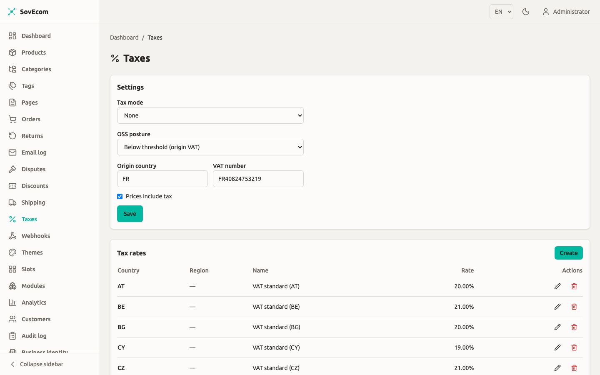
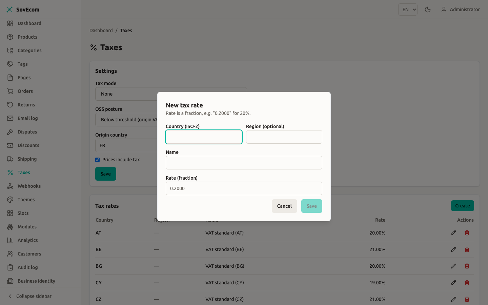

SovEcom computes tax at checkout through a per-tenant **tax regime**. v1 ships two. `none` computes no tax, for merchants who reconcile at filing time. `eu_vat` runs the full EU VAT engine with origin/destination rates, B2B reverse charge, and OSS. You pick the regime, the rates, and the OSS posture from **Admin → Taxes**. This guide covers what each control does and when each rule fires.

Everything below describes the behaviour as shipped, including where a rule fails safe and where a piece is stubbed.

:::caution
Tax and VAT carry legal weight. This guide documents how SovEcom calculates VAT. Whether a given configuration meets your legal obligations is a question for your accountant. Confirm your VAT registration, OSS posture, and rates with them. SovEcom guides correctness. It does not file your returns.
:::

## The two tax regimes

You set the regime with **Tax mode** on the Settings card at the top of **Admin → Taxes**.

| Tax mode | What checkout does | Use it when |
|----------|--------------------|-------------|
| `none` | Tax total is always `0`, no tax lines. Orders still record the net amount and currency so an accountant reconciles externally. | Your business sits outside the EU and you handle tax at filing time. |
| `eu_vat` | The full EU VAT engine: destination/origin rate selection, the OSS €10k threshold, B2B reverse charge, 27 member-state rates, inclusive/exclusive extraction. | You are an EU VAT-registered merchant. |

A fresh store defaults to `none`. The `none` resolver reads neither the `tax_rates` table nor the customer record, so it carries no EU assumptions.



### The EU guardrail

You cannot set `tax_mode = none` while your **Origin country** is an EU-27 member state. The server rejects it with HTTP 422 and the message "An EU VAT-registered merchant must charge VAT". One shared function (`enforceEuGuardrail`) backs both the admin Settings screen and the setup wizard, so the two surfaces never diverge.

The guardrail checks both the value you submit and the value already stored, so "clear the origin country and switch to none in one request" cannot slip past it. The reverse holds too: the server rejects `tax_mode = eu_vat` with no origin country set, also with 422, because origin-VAT and cross-border reverse charge both need to know your country.

A non-EU origin can switch to `none` freely.

## EU VAT setup

With `tax_mode = eu_vat`, fill in the rest of the Settings card.

- **Origin country**: your country of establishment, as an ISO 3166-1 alpha-2 code (`FR`, `DE`, `IE`). The engine reads this to detect cross-border sales and to pick the origin rate below the OSS threshold. Required for `eu_vat`.
- **VAT number**: your own VAT registration number, stored as-is (1 to 32 characters). It appears on invoices. This admin screen does not validate it against VIES.
- **Prices include tax**: a display and calculation setting, independent of the regime. Checked means your stored prices are gross (VAT baked in) and the engine **extracts** VAT. Unchecked means prices are net and the engine **adds** VAT on top. EU consumer stores run inclusive.
- **OSS posture**: see [The OSS €10k threshold](#the-oss-10k-threshold) below.

### Seeding the rates

The engine reads the live standard VAT rate for a country from the `tax_rates` table, keyed by country with a `NULL` region (the country-wide default). It never guesses. When no row exists for the country it needs, it charges **zero** for that sale and you must seed the rate.

Manage rates from the **Tax rates** card on the same screen. Each row holds a country, an optional region, a name, and a rate. The rate is a **decimal fraction**. Enter 20% as `0.2000` and 19% as `0.1900`. The admin table renders it back as a percentage for readability.



The 27 EU member-state standard rates ship as a seed, so a standard install starts with them. The values the engine carries as of 2026:

| Country | Rate | Country | Rate | Country | Rate |
|---------|------|---------|------|---------|------|
| AT | 20% | FR | 20% | NL | 21% |
| BE | 21% | DE | 19% | PL | 23% |
| BG | 20% | GR | 24% | PT | 23% |
| HR | 25% | HU | 27% | RO | 21% |
| CY | 19% | IE | 23% | SK | 23% |
| CZ | 21% | IT | 22% | SI | 22% |
| DK | 25% | LV | 21% | ES | 21% |
| EE | 24% | LT | 21% | SE | 25% |
| FI | 25.5% | LU | 17% | | |
|    |     | MT | 18% | | |

:::caution
Rates change. Estonia rose from 22% to 24% on 2025-07-01, and Finland sits at 25.5%. The seed reflects a yearly review. The engine reads whatever is in `tax_rates`, so a rate you edit takes effect at once and a rate you leave stale stays stale. Check the seeded values against the current EU Commission figures before you rely on them.
:::

v1 covers **physical goods at the standard rate, mainland only**. You can seed reduced and super-reduced rates as extra rows. v1 has no per-product tax category, so every product uses its destination's standard rate. Special territories (Canary Islands, Ceuta, Melilla, Channel Islands, Åland) and digital-goods place-of-supply rules fall outside v1.

## How a rate is chosen at checkout

When the cart recomputes totals, the engine resolves VAT in this order. The destination reads from the cart's **shipping address country**. The B2B status reads from the **cart owner** (the logged-in customer), never from whoever drives the request.

1. **No shipping address yet** maps to tax total `0`. The engine cannot pick a rate without a destination, so VAT appears once the customer enters an address.
2. **Destination outside the EU** maps to no EU VAT (zero-rated export).
3. **B2B cross-border, VAT-validated** maps to reverse charge, 0% VAT. See below.
4. **Otherwise**, the engine picks the origin or destination rate based on the OSS posture (next section), then computes VAT per component (items and shipping each get a line).

v1 taxes items and shipping at the same destination rate and shows them as separate lines. The taxable base for items is the cart subtotal minus any discount already applied, clamped to zero.

## B2B reverse charge

For a cross-border EU B2B sale to a customer whose VAT number is validated, you charge **0% VAT** and the buyer self-accounts (autoliquidation). The engine flags the tax line `reverseCharge`, and the invoice carries the reverse-charge note.

All three conditions must hold for reverse charge to fire:

1. The cart owner is marked B2B (`is_b2b = true` on the customer).
2. Their VAT number was positively VIES-validated (`vat_validated = true`).
3. The sale is cross-border within the EU: destination ≠ origin, and both are EU-27.

Miss any one and the engine charges VAT. A B2B customer with an unvalidated or invalid number gets charged VAT, the legally safe fallback. A B2B same-country sale charges local VAT, never reverse charge.

Set a customer's B2B flag and VAT number from **Admin → Customers** (the create and update forms carry `isB2b` and `vatNumber`). Supplying or changing a VAT number triggers a VIES check.

:::caution[VIES validation is stubbed in this build]
The production VIES client is a placeholder. Its `check()` returns `unreachable` without making a network call, so a customer's VAT number never reaches the `valid` state on its own, `vat_validated` stays `false`, and **automatic reverse charge does not trigger in production yet**. The tri-state seam (`valid` / `invalid` / `unreachable`) and the safe-fallback wiring are complete. The live VIES lookup is **planned for a future release** as a background re-validation job. Until it lands, treat cross-border B2B reverse charge as not auto-applied. The setup wizard shows the same behaviour: it reports "VIES is temporarily unavailable" and never blocks setup.
:::

Under tax-inclusive pricing, a reverse-charge sale strips the embedded destination VAT from the base so you do not overcharge the validated B2B buyer, while the charged VAT stays `0`.

## The OSS €10k threshold

EU One-Stop-Shop changes which country's VAT you charge on cross-border B2C sales, under the €10,000 annual threshold for distance sales. SovEcom does not track your turnover. You declare your posture, and the engine applies it.

Set it with **OSS posture** on the Settings card:

| OSS posture | Cross-border B2C sale charges | Meaning |
|-------------|-------------------------------|---------|
| `below_threshold` | Your **origin** country VAT (your home rate) | Under €10k of cross-border B2C, so you charge home-country VAT and declare it in your domestic return. |
| `above_or_opted_in` | The **destination** country VAT | Over €10k or voluntarily registered for OSS, so you charge the buyer's country rate and report it via OSS. |

The posture only affects **cross-border B2C within the EU**. Domestic sales and B2B-without-reverse-charge always use the destination (local) rate. A non-EU destination stays zero-rated regardless.

:::caution
SovEcom does not monitor whether you have crossed €10,000. You flip from `below_threshold` to `above_or_opted_in` yourself, with your accountant, when your cross-border B2C turnover crosses the line or when you opt in. Set the posture before the sales it should govern, because the engine reads your **current** posture at the time each cart computes.
:::

## OSS export

Once you are on `above_or_opted_in`, SovEcom builds the OSS declaration data as a CSV: every cross-border B2C sale to another EU country within a date window, with the VAT broken out per destination. The CSV is a **convenience aid for your filing**. SovEcom does not submit a return.

### Calling the export

No admin button exists for this yet. Call the endpoint with a `settings:read` token:

```
GET /admin/v1/taxes/oss-export?from=2026-01-01&to=2026-03-31
```

- `from` and `to` take ISO-8601 dates or full datetimes. A date-only `to` covers the whole day, so the closing bound stays inclusive.
- The response is `text/csv` as an attachment (`oss-export.csv`).

:::note[Admin OSS-export button]
The export ships as the API endpoint only. A download button in **Admin → Taxes** is planned for a future release.
:::

### What gets exported

A sale appears in the export only when **all** of these hold:

- The order is not cancelled and not soft-deleted.
- The buyer is B2C (`is_b2b = false`). Intra-EU B2B goes through reverse charge, outside OSS.
- The destination (shipping country) differs from your origin, and both are EU-27.
- The order's `placed_at` falls within `[from, to]`.

The export also enforces a **posture gate**. It only returns rows when your current posture is `above_or_opted_in`. A `below_threshold` tenant charges origin VAT on those same sales and declares them in the domestic return, so it gets a header-only CSV, the same empty result a non-`eu_vat` store gets.

:::caution
The posture gate reads your **current** posture, never a per-order snapshot. If you change posture mid-period, the export reflects the new posture for the whole window. Posture changes are rare. Review the CSV before filing.
:::

### CSV format

The columns are fixed and stable:

```
order_number,placed_at,destination_country,line_type,net,vat_rate,vat_amount,currency
```

| Column | Meaning |
|--------|---------|
| `order_number` | The order's number. |
| `placed_at` | ISO-8601 timestamp the order was placed. |
| `destination_country` | The shipping-address country (upper-cased). |
| `line_type` | `goods`, `shipping`, or `refund`. |
| `net` | Net consideration in integer minor units (cents). Refund rows go negative. |
| `vat_rate` | The VAT rate as stored: a fraction string for goods and shipping, an effective ratio label for refunds. |
| `vat_amount` | VAT in integer minor units. Refund rows go negative. |
| `currency` | ISO 4217 code. |

Each order emits its goods lines, then a single `shipping` line when shipping VAT exceeds zero (EU distance-sale shipping follows the goods rate and counts as OSS-declarable consideration). Refunds that succeeded within the window emit negative correction rows attributed to the order's destination, so the period's exported VAT reconciles to collected-minus-refunded. A refund of an order sold in a prior period still corrects the period the refund was issued in, which is standard credit-note treatment.

All amounts stay in integer minor units. The tax path uses no floats anywhere.

## Quick reference

| Scenario | Customer | Destination vs origin | Posture | Result |
|----------|----------|-----------------------|---------|--------|
| Domestic B2C | B2C | same country | any | Destination (local) VAT |
| Cross-border B2C, below threshold | B2C | different EU country | `below_threshold` | Origin VAT |
| Cross-border B2C, above/opted in | B2C | different EU country | `above_or_opted_in` | Destination VAT (OSS-reportable) |
| Cross-border B2B, VAT-validated | B2B + validated | different EU country | any | 0% VAT, reverse charge |
| Cross-border B2B, not validated | B2B, unvalidated | different EU country | any | VAT charged (fails safe) |
| Same-country B2B | B2B | same country | any | Destination (local) VAT |
| Export | any | outside the EU | any | Zero-rated (no EU VAT) |
| No address yet | any | unknown | any | Tax total `0` until address set |
| Missing rate row | any | EU, no `tax_rates` row | any | Charges `0` (seed the rate) |

## Related guides

- [Shipping Configuration](/operator-guides/shipping/): shipping rates feed the taxable base.
- [Discounts](/operator-guides/discounts/): discounts reduce the taxable base before VAT.
- [Customers](/operator-guides/customers/): set a customer's B2B flag and VAT number.
